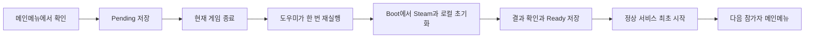

# Exhibition Participant Reset Implementation Plan

상태: 2026-09-07 단순화안 구현 및 자동 검증. 실제 Steam 계정 초기화·재획득과 전시 PC 실운영 검증은 아직 수행하지 않았다. 실행 결과는 연결된 검증 문서를 따른다.

## 1. 목적과 운영 전제

같은 Windows PC와 지정된 전시용 Steam 계정을 여러 참가자가 순차 사용한다. 운영자가 메인메뉴의 **다음 참가자 준비** 버튼을 누르면 이전 참가자의 진행과 업적을 초기화하고 다음 참가자가 동일 업적을 다시 획득하게 한다.

- 정상 전환은 버튼 확인 후 한 번의 자동 재실행으로 끝낸다. 오류가 발생하면 중단하고 운영자가 재시도한다.
- 운영 중 빌드 교체, 무인 장애 복구, 참가자 개인 Steam 계정 전환은 지원하지 않는다.
- 전시용 Windows 사용자 환경에서 기존 canonical SaveRootPath를 사용한다. 계정별 저장 격리나 임의 root override를 추가하지 않는다.
- 이 문서는 기존 세 프로세스·자동 복구 계획을 대체한다. 실제 Steam 변경이나 배포를 수행한 기록이 아니다.

## 2. 초기화 범위와 필요한 기존 경계

| 대상 | 처리 |
| --- | --- |
| Steam | production mapping의 대상 업적만 ClearAchievement 후 일괄 StoreStats |
| 제품 업적 | earned·pending과 저장소가 소유한 백업·중단된 쓰기 복구 상태 초기화 |
| 캠페인 | 전체 슬롯 진행·정상 클리어 기록·마지막 슬롯 초기화 |
| 실행 상태 | 활성 슬롯·local-launch-state·시작 예약 정리. 이전 메모리는 프로세스 종료로 분리 |
| 설정·진단 | 음량·화면·조작·언어 설정과 로그 보존. PlayerPrefs 전체 삭제 금지 |

현재 예상 Steam 대상은 VQ_LEVEL_0_CLEAR부터 VQ_LEVEL_4_CLEAR까지다. 실제 게시된 API 이름과 client 변경 가능 여부, Progress Stat 연결은 실연동 준비 시 확인한다. 런타임 열거 결과를 전체 삭제 목록으로 사용하거나 ResetAllStats(true)로 통계까지 초기화하지 않는다.

다음은 현재 코드가 요구하는 경계다.

| 근거 | 필요한 조치 |
| --- | --- |
| [ProductAchievementCoordinator](../../Assets/_Features/Achievements/Achievement_Domain/Runtime/ProductAchievementCoordinator.cs) | pending이 없어도 earned가 다시 전송되므로 로컬 장부도 초기화 |
| [CampaignStageAchievementStartupReconciler](../../Assets/_Features/Achievements/Achievement_CampaignIntegration/Runtime/CampaignStageAchievementStartupReconciler.cs) | 모든 슬롯의 클리어 기록에서 업적을 복구하므로 캠페인 전체 초기화 |
| [ProductAchievementApplicationComposition](../../Assets/_Features/Achievements/Achievement_Composition/Runtime/ProductAchievementApplicationComposition.cs), [SteamProductAchievementPublicationFeature](../../Packages/com.j2m.platform.steam/Runtime/ProductAchievements/SteamProductAchievementPublicationFeature.cs) | 자동 host/Publisher 시작을 보류하고 초기화 후 최초 정상 시작 |
| [SteamPlatformRuntime](../../Packages/com.j2m.platform.steam/Runtime/SteamPlatformRuntime.cs), [PlatformRuntimeApplicationHost](../../Assets/_Core/Runtime/Platform/PlatformRuntimeApplicationHost.cs) | 초기화 중에도 canonical Steam lifecycle과 callback pump 유지 |
| [CampaignSaveService](../../Assets/_Features/Stages/Runtime/Campaign/Save/CampaignSaveService.cs), [ActiveSlotStorage](../../Assets/_Features/Stages/Runtime/Campaign/ActiveSlotStorage.cs) | ClearAll은 프로필 로드가 필요하며 활성 슬롯·시작 예약 wrapper를 통해 호출 |
| [FileProductAchievementRepository](../../Assets/_Features/Achievements/Achievement_Infrastructure/Runtime/FileProductAchievementRepository.cs), [AtomicTextFileStore](../../Assets/_Features/Stages/Runtime/Campaign/Save/AtomicTextFileStore.cs) | .bak/.rollback에서 이전 업적이 살아나지 않도록 소유 저장소에서 초기화 |

현재 제품 계약은 [Product Achievement Foundation](./Product-Achievement-Foundation.md), [Platform Runtime Foundation](./Platform-Runtime-Foundation.md), [Steam Cloud File Inventory Policy](./Steam-Cloud-File-Inventory-Policy.md)를 따른다.

## 3. 최소 구조와 제거성

예정 위치는 `Assets/_Features/Exhibition/`이다. 런타임 어셈블리는 다음 두 경계로 시작한다. 빌드 검사에는 필요할 때 Editor assembly를 둔다.

| 경계 | 책임 |
| --- | --- |
| Exhibition.Application | 순수 C# Coordinator, Pending/Ready 처리, 결과·실패 계약과 좁은 포트 |
| Exhibition.Integration | Steam/저장/재실행 Adapter, UI와 Composition. 각 책임은 폴더·클래스로 분리 |

Application은 Unity·Steamworks·직접 파일 IO에 의존하지 않는다. v1 Integration 전체는 전시용 Windows 및 기존 Steamworks.NET 가용 조건을 따른다. 일반 게임 어셈블리가 Exhibition을 참조하지 않고 전시 Adapter가 기존 소유자의 포트를 참조한다.

기존 ISteamAchievementApi와 일반 SteamworksNetNativeApi에 reset 함수를 추가하지 않는다. [SteamPlatformArchitectureTests](../../Packages/com.j2m.platform.steam/Tests/EditMode/SteamPlatformArchitectureTests.cs), [SteamworksNetDependencyInventoryTests](../../Packages/com.j2m.platform.steam.steamworksnet/Tests/EditMode/SteamworksNetDependencyInventoryTests.cs)의 경계를 유지하는 전시 전용 reset surface를 둔다. 이 surface는 canonical Steam 런타임의 콜백 소유권을 사용하며 별도 native lifecycle을 만들지 않는다.

일반 영역 변경은 서비스의 시작 보류/최초 시작, Steam 업적 작업의 단일 소유권과 계정 확인, 업적 저장소의 명시적 초기화 포트에 한정한다. WorldState/TickPipeline과 게임플레이 규칙에는 전시 분기를 넣지 않는다.

전시 빌드 프리셋은 Boot Scene·전시 Composition·Steam 조건·도우미 포함을 확인한다. 런타임 필수 의존성은 전시 Composition 진입에서 한 번 확인한다. 범용 모듈 검증기나 계층별 중복 가용성 검사를 만들지 않는다. 기능별 asmdef 분할은 실제 의존 문제가 생길 때만 추가한다.

## 4. 정상 실행 흐름

1. 메인메뉴에서 대상과 전체 진행 초기화를 확인한다. 중복 클릭과 새 게임 시작을 막고 Pending을 먼저 저장한다. 저장 실패 시 초기화와 자동 종료를 시작하지 않는다.
2. 요청 저장 후 일반 업적 전송을 중단하고 현재 게임을 종료한다. 진행 중 콜백과 이전 메모리는 이 프로세스에서 끝낸다. Steam/참가자 데이터 초기화는 다음 프로세스에서만 수행한다.
3. 도우미는 지정된 이전 프로세스 종료를 확인한 뒤 같은 전시 실행 파일을 한 번 시작한다. provider 선택 인자를 보존하고 경로·인자를 구조화하여 전달한다.
4. 새 Boot는 유효한 Pending을 확인한 후 Steam·로컬 초기화와 결과 확인을 수행한다. 성공하면 Ready를 내구성 있게 저장한다.
5. reset 콜백 소유권을 해제한 뒤 같은 프로세스에서 일반 업적 host/Publisher를 처음 시작한다. 정상 서비스 준비 성공 후 MainMenu를 로드하고 참가자 플레이를 허용한다.

전시 빌드만 모듈 소유의 최소 Boot Scene을 첫 씬으로 둔다. 공유 MainMenu Scene에 전시 컴포넌트를 추가하지 않는다. Boot Scene만 추가해도 BeforeSceneLoad 자동 초기화는 실행되므로, 기존 bootstrap과 Steam publication 생성에도 명시적인 보류 정책을 연결한다. Platform host와 callback pump는 보류하지 않는다.

기록 없음 또는 Ready인 부팅은 참가자 초기화를 실행하지 않는다. 일반 서비스만 시작하여 현재 진행을 유지한다. 캠페인 업적 복구는 Boot Scene의 첫 AfterSceneLoad에서 소모하지 않고 실제 MainMenu의 sequence provider 준비 뒤 한 번 수행한다.

정상 서비스 시작 실패 시 오류를 표시하고 플레이를 막는다. Ready를 Pending으로 되돌리지 않으며 다음 실행에서도 완료한 reset을 반복하지 않는다.

한 번 재실행 방식은 구현 목표다. reset 콜백 해제 후 정상 Publisher 최초 연결과 재획득을 실연동으로 검증한다. 추가 프로세스가 꼭 필요하다는 실행 근거가 나오면 해당 경계만 재설계한다. 별도 Verify 프로세스를 기본 요구사항으로 두지 않는다.

## 5. 작업 기록과 실패 처리

기록은 canonical 저장 루트의 전시 모듈 소유 `exhibition-reset.json` 하나를 사용한다. 게임 프로세스만 기록하며 도우미는 이 파일을 수정하지 않는다. 참가자 데이터 초기화 대상에서도 제외한다.

최소 필드는 schemaVersion, operationId, Pending/Ready 상태, AppID, SteamID, 대상 mapping 식별이다. 경로는 주입된 SaveRootPath만 사용한다. 임의 파일 경로나 삭제 목록을 journal/실행 인자로 받지 않는다.

| 상태 | 처리 |
| --- | --- |
| 기록 없음 | 기존 참가자 진행으로 정상 부팅 |
| Pending | 지정 계정·AppID·대상을 확인하고 전체 초기화 절차를 한 번 시도 |
| Ready | 초기화 완료. 정상 부팅만 수행 |
| 기록 손상/미지원/대상 불일치 | 오류 표시 후 중단. 자동 복원·새 작업으로 교체하지 않음 |

Pending에서 중단되면 일부 작업이 이미 반영되었을 수 있다. 다음 시도는 같은 범위의 초기화를 처음부터 다시 수행한다. 단계별 완료 이력, 보정 계획, nextAction은 저장하지 않는다. 같은 초기화 반복이 가능하도록 Adapter를 구현하며, Ready 이전에는 새 참가자의 플레이가 시작되지 않는다.

자동 실패 재시도는 하지 않는다. 각 실행은 한 번만 시도하고 오류 화면에 머문다. 운영자의 재시도는 기록을 유지한 채 새 프로세스로 재실행한다. 전원 종료 후 수동 실행도 Pending이면 한 번 시도한다. 게임/도우미가 실패한 자식을 계속 다시 띄우는 루프를 만들지 않는다.

Ready는 초기화 결과 확인 뒤, 일반 서비스 시작 전에 기록한다. 다음 참가자의 정상 진행이 생긴 뒤 완료 작업이 반복되지 않게 완료 기록을 유지한다. 새 참가자 초기화 버튼 확인만 새 operationId와 Pending을 만든다.

journal은 원자적 교체를 사용하고 일반 참가자 저장의 과거 .bak/.rollback 자동 복구를 재사용하지 않는다. 원본 손상/누락 상태에서 companion만 남으면 중단한다. Ready 이후 이전 Pending을 자동 복원하지 않는다. 복잡한 자동 수선 엔진은 만들지 않으며, 기록 이상은 운영자가 데이터를 확인한 뒤 처리한다. 외부에서 기록과 모든 companion을 함께 삭제한 경우까지 최초 실행과 구분한다고 보장하지 않는다.

## 6. Adapter의 필수 계약

### Steam

- 현재 계정·AppID와 지정된 대상 schema를 확인하고 대상별 ClearAchievement 후 StoreStats를 일괄 요청한다. 실패를 성공으로 간주하지 않는다.
- reset과 일반 Publisher는 동시에 저장/콜백을 소유하지 않는다. 기존 smoke 실행과도 함께 사용하지 않는다.
- Store 반환값, 해당 AppID의 UserStatsStored 결과, 대상 전체의 GetAchievement 성공과 achieved=false로 결과를 확인한다. 기존 full-unlock 콜백을 초기화 성공 판정에 재사용하지 않는다.
- 호출 반환 전에 도착한 콜백도 처리한다. 시간 초과나 결과 불명확 시 세션을 중단하고 운영자에게 오류를 표시한다. 같은 세션에서 새 Store 요청으로 늦은 콜백을 재해석하지 않는다.
- 계정 불일치나 로그아웃은 중단한다. journal을 현재 계정에 재바인딩하여 우회하지 않는다.
- 저장 성공 후 콜백 소유권을 해제하고 정상 Publisher의 최초 연결이 가능해야 한다. 기존 OnSteamInitialized를 다시 부르면 된다고 가정하지 않는다.

Steam 클라이언트의 조회를 독립적인 서버 영속성 증명으로 표현하지 않는다. 새 실행 유지와 실제 반복 재획득·팝업은 실연동 통과 조건이다. Progress Stat 연동 등 대상 업적만 초기화해서는 유지되지 않는 schema면 원인을 확인하고 명시적인 범위를 다시 정한다.

참고: [ClearAchievement](https://partner.steamgames.com/doc/api/ISteamUserStats#ClearAchievement), [StoreStats](https://partner.steamgames.com/doc/api/ISteamUserStats#StoreStats), [Stats and Achievements](https://partner.steamgames.com/doc/features/achievements).

### 참가자 저장

- 캠페인은 활성 슬롯과 시작 예약 정리 wrapper를 포함한 기존 ClearAll 경로를 사용한다.
- 업적은 원본·백업·중단된 쓰기 상태를 소유 저장소에서 함께 초기화한다. Save(empty)나 원본 파일 삭제만으로 완료하지 않는다.
- 초기화 후 소유 저장소로 결과를 확인한다. Pending 동안의 정상적인 저장소 복구/임시 파일 정리는 허용하되, 이전 earned·pending·클리어 기록이 복원되면 성공으로 처리하지 않는다. 별도 읽기 전용 Verify 전용 probe는 만들지 않는다.
- ClearAll이 손상/버전/IO 문제로 실패하면 오류를 표시한다. 기존 recovery 포트가 지원하는 복구는 별도 운영자 조치로 사용하고, 자동 손상 수선 기능은 새로 만들지 않는다. 기존 캠페인 pending reset도 먼저 해결해야 한다.
- Steam과 여러 로컬 파일은 단일 트랜잭션이 아니다. 실패하면 Pending을 유지하고 완료 방향으로 다시 시도한다. 이전 Steam 달성 상태를 자동 복원하는 보상은 제공하지 않는다.

### 재실행

- 도우미는 종료 확인과 한 번 실행만 담당한다. journal writer, 영속 재시도 예산, 인계 단계별 준비 응답 프로토콜을 갖지 않는다.
- 게임은 저장 접근 전에 단일 실행을 확인한다. 두 번째 게임은 초기화하지 않고 종료한다. 도우미를 중복 생성하지 않도록 버튼 요청을 한 번만 접수한다.
- 종료 대기는 제한 시간을 둔다. 초과 또는 실행 실패 시 간단한 오류 메시지와 수동 게임 실행 안내를 제공한다. 다른 소유자의 프로세스를 강제 종료하지 않는다.
- 자식 생성 성공을 참가자 준비 완료로 표시하지 않는다. 실제 준비/오류 안내는 자식 Boot가 담당한다. 도우미에 별도 복구 애플리케이션을 만들지 않는다.

## 7. 운영 UI, 빌드와 제거

게임 UI는 확인·진행·오류·재시도·종료만 제공한다. 전송 제한이나 통신 오류에서 무한 대기하지 않는다. 재시도는 운영자가 선택하며 초기화 완료를 되돌리는 취소 기능은 제공하지 않는다. 종료는 기록 보존과 종료를 의미한다.

전시 UI와 Boot Scene은 모듈이 소유한다. 빌드 프리셋에서 필요한 첫 씬·전시 등록·Steam 의존성·도우미 파일을 확인하고, 일반 빌드는 전시 구성을 함께 제외한다. 제거성은 어셈블리 개수보다 의존 방향과 공유 자산 참조 부재로 확보한다.

빌드 교체/기능 제거는 전시 운영을 중단하고 게임·도우미를 종료한 상태에서 수행한다. 미완료 또는 손상 journal이 있으면 먼저 확인·해결하고 교체한다. 운영 중 교체, 배포기 다중 잠금, 배포 세대 관리와 지연된 예약 인계 무효화는 v1 범위 밖이다.

모듈 제외 후 기존 첫 씬 순서를 복원하고, 참조 잔재 없이 빌드·부팅·저장·일반 업적 획득이 가능한지 확인한다. 일반 Core가 전시 journal을 해석하게 만들지 않는다. 운영 절차를 무시한 실행 중 파일 교체까지 안전하다고 주장하지 않는다.

전시 전에 실제 Steam Cloud 설정과 동일 계정을 사용하는 다른 실행 환경을 확인한다. 외부 기기/Cloud가 이전 데이터를 다시 공급하는 운영은 지원 범위에 넣지 않는다.

## 8. 구현 순서와 검증

| 순서 | 구현/검증 |
| --- | --- |
| 1 | 지정 계정/AppID에서 격리된 reset·재획득 실험. 현재 Publisher와 동시에 reset하지 않음 |
| 2 | Boot와 명시적 시작 보류, reset callback 해제 후 동일 프로세스의 정상 Publisher 최초 연결 검증 |
| 3 | Pending/Ready Coordinator와 저장·Steam Adapter. 중단 후 전체 재시도 및 Ready 이후 재초기화 방지 |
| 4 | 한 번 재실행 도우미와 버튼 UI. 정상 경로 자동 완료, 오류는 운영자에게 반환 |
| 5 | 전시 PC 반복 운영과 모듈 제외 빌드 검증 |

핵심 테스트는 다음으로 한정한다.

1. 참가자 A 획득 → 초기화 → 참가자 B 동일 업적 재획득. 실제 팝업과 재부팅 후 유지도 관측한다.
2. 중복 클릭/실행에서 초기화가 중복 진행되지 않는다.
3. 네트워크 끊김·Store 실패·시간 초과에서 Pending 유지와 오류 표시. 운영자 재시도는 새 세션에서 진행한다.
4. Steam/로컬 변경 및 Pending/Ready 쓰기 전후 중단에서 전체 재시도 또는 정상 부팅으로 복구한다. .bak/.rollback이 이전 참가자의 기록을 되살리지 않는다.
5. Ready 이후 새 진행 저장·재부팅·정상 서비스 시작 실패가 완료한 초기화를 재실행하지 않는다. journal 손상은 자동 reset으로 이어지지 않는다.
6. 계정/대상 불일치, 재실행 실패와 저장 실패를 성공으로 표시하지 않는다. 실행 실패는 수동 실행으로 이어갈 수 있다.
7. 전시 기능을 제외한 빌드가 일반 부팅·저장·업적 동작을 유지한다.

실행한 검증과 미실행 검증은 분리해서 보고한다. 구현 변경에는 현재 worktree에서 `./run_tests.sh core`, UI 구현에는 `./run_tests.sh ui`, 실제 변경된 platform/achievement/save 및 수명 경계의 touched-cluster 테스트를 적용한다. Scene/Prefab의 목적과 Editor/Player 수동 증거도 남긴다. full lane을 실행하지 않은 결과로 broad 통과를 주장하지 않는다.

새 구현 worktree는 `j2m-worktree-add`로 `/mnt/d/J2M/worktrees`에 생성하며 D 여유 30 GiB와 검증 전 resolved path를 확인한다. 기존 C worktree는 이동하지 않는다. 새 증거는 `/mnt/d/J2M/evidence`, 빌드는 `/mnt/d/J2M/builds`에 둔다.

## 9. 단순화 결정과 검토 상태

자동 실패 재시도를 제거하여 영속 예산·승인 기록·도우미 journal 쓰기·복잡한 인계 잠금도 제거했다. 세 번째 검증 프로세스, phase/nextAction 보정 모델, 별도 비변경 probe, 도우미 복구 시스템, 운영 중 배포 대응은 기본 구현에서 제외했다. 전시 운영에 필요한 대상 제한·전송 차단·작업 기록·중복 방지·오류 표시는 유지했다.

2026-09-07 단순화 후 서브 에이전트 2명이 각각 정상 전환/흔한 실패와 구조/제거성을 재검토했다. 문서 수준에서 정상 흐름의 필수 누락이나 구조적 모순은 추가로 발견하지 못했으며, 추가 프로세스·정책 확대를 요구하지 않았다. 같은 프로세스에서 reset 후 정상 Publisher 최초 연결과 실제 재획득은 첫 실연동 검증 대상으로 유지한다. 기존 확장안의 검토 기록을 본 단순화안의 실행 검증 근거로 사용하지 않는다.

## 10. 구현 연결과 실행 방법

구현 worktree는 `/mnt/d/J2M/worktrees/exhibition-reset`, branch는 `feature/exhibition-reset`이다.

| 책임 | 구현 |
| --- | --- |
| 요청·재개 및 Pending/Ready | `Assets/_Features/Exhibition/Application/ExhibitionResetCoordinator.cs` |
| 원자적 저널 | `Integration/FileExhibitionResetJournal.cs` |
| 대상 Steam 초기화 | `Integration/SteamExhibitionResetAdapter.cs` |
| 캠페인·업적 저장 초기화 | `Integration/ParticipantProgressResetAdapter.cs` |
| Boot와 조립 | `Integration/ExhibitionApplication.cs`, `Scenes/ExhibitionBoot.unity` |
| 운영 UI | `Integration/ExhibitionView.cs` |
| 한 번 재실행 | `Integration/ExhibitionRelaunchAdapter.cs`, `Tools/Exhibition-Relaunch.ps1` |
| 별도 Windows 빌드 | `Editor/ExhibitionBuild.cs` |

표의 상대 경로는 `Assets/_Features/Exhibition/` 기준이다. 일반 코드에는 선택적인 시작 제어(`ProductAchievementStartupControl`), Steam callback maintenance lease(`SteamAchievementMaintenanceAccess`), 저장소 소유의 destructive reset만 추가한다. 일반 Player에서 시작 보류 기본값은 false이며 전시 assembly는 제외된다. Editor에는 fake 테스트를 위해 assembly를 포함하지만 Boot는 Editor에서 실제 초기화를 실행하지 않는다.

Windows x64 target을 선택한 Unity의 batch executeMethod는 `Game.Exhibition.Editor.ExhibitionBuild.BuildWindows`다. 필수 인자는 `-exhibitionOutput D:\J2M\builds\exhibition\VectorQuake.exe -exhibitionAppId <지정 AppID> -exhibitionSteamId <지정 SteamID>`다. 실제 계정 값을 추정하거나 예제 AppID를 기본값으로 넣지 않는다. builder는 기존 release BuildOptions에 Boot를 앞에 추가하고 `extraScriptingDefines`에 `J2M_EXHIBITION`을 넣는다. 전역 scene/define 설정을 수정하지 않는다.

출력 실행 파일 옆에 `exhibition.json`, `Exhibition-Relaunch.ps1`, 지정 AppID의 `steam_appid.txt`가 배치된다. 이는 별도 전시 실행용이며 SteamPipe 배포물로 사용하지 않는다. 첫 실행에도 `-j2mPlatformProvider steam` 인자가 필요하다. 이후 helper는 이 인자로 같은 실행 파일을 한 번 실행한다. 설정은 AppId, SteamId, RelaunchTimeoutSeconds(기본 30초)다. 일반 release의 별도 backend/stripping/evidence pipeline 실행을 이 builder가 대신한다고 간주하지 않는다.

전시 코드 제거는 `Assets/_Features/Exhibition` 폴더와 해당 `.meta` 제거로 시작한다. 일반 코드에는 전시 assembly 참조가 없으므로 선택적 시작/저장 API는 호출되지 않는 상태로 남겨도 된다. 일반 release의 scene list는 수정하지 않았으므로 별도 복원이 필요 없다. 교체 전 Pending/손상 저널을 해결하는 7절 운영 조건은 그대로 적용한다.

검증 결과와 미실행 항목은 [Exhibition-Participant-Reset-Validation.md](../Testing/Exhibition-Participant-Reset-Validation.md)에 기록한다. Steam 재획득/팝업과 Windows 실운영 확인 전까지 전시 배포 승인 근거로 사용하지 않는다.

전시 Boot의 최초 메뉴 로드는 직접 scene load의 한정 예외다. Boot에는 기존 ReturnToMainMenu가 요구하는 gameplay/comic source presenter가 없으므로 해당 의미를 재사용하지 않는다. 기존 RouteConfig의 MainMenuSceneName을 참조하며, 예외는 전시 assembly 제외와 함께 제거된다. UI 구조 검사는 이 파일 하나만 선택적으로 허용하고, 다른 production route의 기존 검증을 유지한다.
