# 런타임 아키텍처 다이어그램 검증 보고서

> Historical snapshot from 2026-09-16. The current final execution stage is
> `MoonBlockGeneration` (numeric value 4); player in-world respawn has been removed.
> See [Tick Simulation Canonical Spec](./Tick-Simulation-Canonical-Spec.md) for
> the current pipeline contract.

- 조사일: 2026-09-16
- 조사 방식: 저장소 코드, Unity Scene/설정, 패키지 및 문서의 읽기 전용 조사
- 교차 검토: 1차 gameplay/UI·persistence/Steam·보고서 완전성 검토에 더해, Tick 실행 흐름·상태 변경 경계·presentation/결정성을 나눈 3개 독립 서브 에이전트가 반증 중심으로 재검토한 뒤 주 에이전트가 지적 근거를 재확인
- 기준: 문서와 코드가 충돌할 경우 실제 런타임 코드와 Unity 연결을 우선

조사 당시 작업 트리는 `main...origin/main [ahead 1, behind 1]`이었고, 기존 수정 파일 `Docs/Architecture/README.md` 및 기존 미추적 파일 `Assets/AddressableAssetsData/Windows.meta`, `Docs/Architecture/MainMenu-Logo-Interaction-Effect-Implementation-Plan.md`가 있었다. 이 조사에서는 해당 파일을 수정하거나 되돌리지 않았다.

## 1. 외부인용 요약

이 게임은 메뉴 조작과 실제 게임플레이 조작을 서로 다른 입력 경로로 처리한다. 메뉴의 키보드·컨트롤러 입력은 UI navigation router가, 마우스 입력은 Unity EventSystem과 Button/Pointer event가 처리하지만, 이동·밀기·플립의 직접 입력은 UI를 거치지 않고 게임플레이 입력 호스트에서 틱 명령으로 변환된다. 캠페인 저장 데이터는 현재 스테이지와 잔여 기회 등을 결정하고, 스테이지 카탈로그는 해당 식별자에 맞는 규칙·화면 구성·오디오 정의를 제공한다. 게임플레이 장면 호스트는 이 정의들로 월드, 틱 실행기, 화면 표시기와 UI 접근 계층을 조립한다. 틱은 고정 간격으로 실행되며 같은 초기 상태와 입력열에 대한 재현성 테스트가 있지만, 프레임 스케줄링·플랫폼 간 bitwise 동일성·진행 중 pipeline의 snapshot-only 복원까지 보장된 것은 아니다. 게임 보드의 권위 있는 상태는 `WorldState`에 집중되어 있고 규칙 계산은 복사 기반 읽기 모델인 `WorldSnapshot`을 사용하지만, 지연 공격·리스폰 지연·목표 추적 등 pipeline 소유 상태는 별도로 존재한다. 계산된 변경은 Finalize 배치뿐 아니라 Cleanup과 Respawn의 제한된 쓰기 컨텍스트를 통해 반영되므로 “단일 Commit 경로만 사용한다”는 표현은 너무 강하다. 틱 결과에는 최종 entity/topology projection과 별도의 프레젠테이션 신호 묶음이 들어가며, 연출 계획은 틱 직후 제출되고 애니메이션·오디오·VFX·카메라는 이후 Unity 프레임에서도 진행된다. 캠페인 프로필과 업적 장부는 가능한 환경에서 원자 교체를 사용하고 그 외에는 backup/rollback 기반 복구 가능한 JSON 교체 절차를 사용하지만, 음량·화면·입력·언어 설정은 Unity `PlayerPrefs`를 사용한다. Steam 연동 코드는 실제로 존재하지만 명시적으로 Steam provider를 선택하고 유효한 Steam 세션이 성립한 경우에만 업적을 게시하며, owner가 제공한 App/Depot identity 및 실제 Steamworks App Admin 게시·실계정 해제 상태는 외부 확인이 필요하다.

## 2. 한눈에 보는 판정

| 다이어그램 요소 또는 연결 | 판정 | 실제 구현 | 핵심 근거 |
|---|---|---|---|
| 플레이어 입력 | 부분적으로 정확함 | 메뉴 입력과 게임플레이 입력이 분리됨 | `UiNavigationInputRouter`, `GameplayInputHost` |
| `Input → UI` | 부분적으로 정확함 | 키보드·컨트롤러 메뉴 navigation과 EventSystem 기반 pointer 입력에는 맞지만 Move/Push/Flip은 UI를 우회 | `UiNavigationInputRouter.BindActions`, `EnsureEventSystem`, `GameplayInputHost.BindActions` |
| UI | 정확함 | Screen, Popup, HUD와 Application/Flow/ViewModel/View 계층 존재 | `Assets/_Features/UI/*` |
| `UI → Campaign` | 부분적으로 정확함 | 새 게임·이어하기 등에는 맞지만 모든 UI와 입력이 캠페인으로 가지는 않음 | `MainMenuController`, `UIFlowCoordinator` |
| Campaign | 정확함 | 3개 슬롯, 새 게임, 이어하기, 죽음 재시도, 완료 및 다음 스테이지 저장 경로 존재 | `CampaignSaveSlotPolicy`, `CampaignGameplayFlowController` |
| `Campaign → Stage` | 정확함 | 저장된 StageId를 handoff/context로 전달하고 catalog에서 해석 | `CampaignLaunchHandoff`, `StageLaunchContextStore`, `StageRuntimeContentResolver` |
| Stage Content | 정확함 | production Catalog Provider/Sequence asset이 두 Scene에 직렬화되고 Resolver/Builder와 companion 정의가 연결됨 | `CampaignMain_StageCatalogProvider.asset`, `CampaignMain_StageSequence.asset`, Scene YAML |
| `Stage → Host` | 정확함 | installer가 초기 상태와 presentation 구성을 만들어 Host를 초기화 | `StageBackedGameplaySceneInstallerBase.BuildInitialGameplayState` |
| Gameplay Scene Host | 부분적으로 정확함 | `GameplaySceneHost`는 Unity-facing façade이고 실제 조립은 `GameplayHostRuntimeFactory`가 수행 | `GameplaySceneHost.Initialize`, `GameplayHostRuntimeFactory.Create` |
| `Host → Tick` | 부분적으로 정확함 | Host가 Runner를 직접 호출하지 않는다. Factory가 Runner/Pipeline을 구성하고 실제 Tick 호출은 `GameplayInputHost`가 수행 | `GameplayHostRuntimeFactory.Create`, `GameplayInputHost.RunSingleTickUnlocked` |
| Deterministic Tick Simulation | 부분적으로 정확함 | fresh-pipeline replay/hash 테스트는 있으나 scheduling은 `Time.deltaTime` 기반이고 cross-platform/snapshot-only 복원은 미입증 | `TickReplayDeterminismTests`, `GameplayInputHost.Update`, pipeline-owned state |
| Movement, Attack, Cleanup, Respawn | 부분적으로 정확함 | Movement/Attack은 독립 stage가 아니며 Resolve 내부에서 잠정 공격 결과가 일부 이동 impact 결정을 다시 닫는 상호 조정 과정이다. Cleanup/Respawn만 최상위 실행 stage | `TickPipeline.RunResolvePhase`, `TickPhase` |
| WorldState | 부분적으로 정확함 | 권위 있는 보드/엔티티 상태 소유자는 맞지만 delayed attack·respawn delay·objective 및 client 상태는 별도 | `WorldState`, `TickPipeline`, `RespawnProcessor` |
| `Tick → World: Commit 경로로만 변경` | 부분적으로 정확함 | Finalize batch, Cleanup commit context, Respawn write context가 쓰며 초기 구성도 별도 | `FinalizationBatch.ApplyTo`, `RunCleanupPhase`, `RunRespawnPhase` |
| `World → Snapshot` | 정확함 | 사전·중간·최종 snapshot을 생성 | `WorldState.CreateSnapshot`, `SnapshotBuilder.Create` |
| WorldSnapshot | 정확함 | 복사된 dictionary/value 기반 읽기 모델이며 가변 원본 래퍼가 아님 | `WorldState.CreateSnapshot`, `WorldSnapshot` |
| `Snapshot → Tick` | 정확함 | Plan, Resolve, AI, Cleanup, Respawn, objective 질의에 사용 | `TickPipeline.RunTick` |
| TickResult | 부분적으로 정확함 | 최종 entity 목록과 topology, 단계, 이벤트, objective, trace, presentation data를 포함하지만 `WorldState`나 완전한 `WorldSnapshot`은 포함하지 않음 | `TickResult` |
| `Tick → Result` | 정확함 | 최종 snapshot과 단계 결과로 builder가 생성 | `TickPipeline.RunTick`, `TickResultBuilder.Build` |
| PresentationData | 부분적으로 정확함 | TickResult와 같은 객체가 아니라 `TickResult.PresentationData`로 포함됨 | `TickResult.PresentationData` |
| `Result → Presentation` | 정확함 | 결과와 연출 계획은 즉시 전달되고 시간 기반 효과는 이후 Unity frame에서 진행 | `RunSingleTickUnlocked`, `GameplayTickViewPresenter.LateUpdate` |
| Presentation | 정확함 | View, animation, audio, VFX, topology, post-fx, camera 처리가 연결됨 | `GameplayTickPresentationCoordinator.Present`, `GameplayTickViewPresenter.Present` |
| `Presentation → Output` | 정확함 | Unity View/Animator, Audio, VFX, post-processing, camera pose로 반영 | presentation controller/lane |
| `Campaign → Persistence` | 정확함 | profile 및 active-slot 파일 저장 경로 존재 | `CampaignSaveService`, `FileCampaignProfileRepository` |
| Persistence | 부분적으로 정확함 | 캠페인/업적은 `File.Replace` 우선 및 backup/rollback fallback JSON이고 설정은 PlayerPrefs; 런타임 월드 저장은 없음 | `AtomicTextFileStore`, `PlayerPrefs*Store` |
| Achievement | 정확함 | 조건, 중복 방지, 로컬 장부, pending publication 구현 | `CampaignStageAchievementIntegration`, `ProductAchievementCoordinator` |
| `Result → Achievement` | 부정확함 | 직접 연결은 없다. 다만 clear 및 현재 시도 지표는 TickResult 계열 데이터에서 유래하고, terminal 판정과 캠페인 저장 성공을 거친 committed clear가 실제 획득 호출을 일으킨다 | `GameplayHostPresentationFeed.HandleTickCompleted`, `CampaignGameplayFlowController.HandleAcceptedStageClear` |
| `Achievement → Platform` | 부분적으로 정확함 | 일반 platform API가 아니라 Steam publication session handoff에 연결; Local은 게시하지 않음 | `ProductAchievementPublicationSessionHandoff` |
| Platform Runtime | 정확함 | Local 기본 provider와 등록형 Steam provider가 존재 | `PlatformRuntimeRegistry`, `LocalPlatformRuntime`, `SteamPlatformRuntime` |
| `Platform -.-> Steam` | 부분적으로 정확함 | 코드상 선택적 연동은 구현됐지만 실제 App Admin 게시/계정 해제는 미확인 | Steam packages 및 release handoff 문서 |
| Steamworks | 부분적으로 정확함 | SDK, Init, callbacks, SetAchievement/StoreStats는 존재; Cloud는 비활성 | `SteamworksNetNativeApi`, Steam Cloud 정책 |
| 화면·소리·피드백 | 정확함 | 틱 및 UI 신호를 presentation 실행기들이 소비 | presentation/audio/VFX/camera runtime |

### Tick 다이어그램 세부 판정

| 원본 연결 | 판정 | 실제 구현 |
|---|---|---|
| `GameplaySceneHost → TickRunner` | 부분적으로 정확함 | Host는 Factory에 구성을 위임하고 실제 호출은 `GameplayInputHost`가 수행 |
| `TickRunner → Plan` | 부분적으로 정확함 | Runner는 `TickPipeline.RunTick`을 호출하며 allocator reset, delayed-effect drain, snapshot/logic 구성 뒤 Plan 진입 |
| `Plan → Movement` | 부정확함 | Movement는 stage가 아니며 intent 수집·확장·legality가 이미 Plan 안에 포함 |
| `Movement → Attack` | 부정확함 | Resolve 안에서 이동 projection과 잠정/최종 공격이 상호 피드백하며 조정됨 |
| `Attack → Finalize` | 부분적으로 정확함 | 공격 operation이 FinalizationBatch에 기록되어 Finalize에서 적용되지만 Attack stage는 없음 |
| `Finalize → Cleanup/Respawn` | 부분적으로 정확함 | 실제 순서는 `Finalize → Cleanup → Respawn`이며 두 lifecycle stage는 분리됨 |
| `Cleanup/Respawn → TickResult` | 부분적으로 정확함 | Respawn 뒤 objective advance와 final snapshot/result build가 추가로 수행됨 |
| `WorldState → Plan` | 부분적으로 정확함 | 직접 질의가 아니라 `WorldSnapshot`과 projected snapshots를 통해 읽음 |
| `Finalize → WorldState` | 정확함 | ordered FinalizationBatch operation을 write context로 적용 |
| `Cleanup/Respawn → WorldState` | 부분적으로 정확함 | 두 stage가 서로 다른 제한된 commit/write 경로로 직접 변경 |
| `TickResult → Presenter` | 정확함 | Runner 반환 뒤 InputHost가 Presenter에 전달하며 이후 TickCompleted 구독자도 소비 |

## 3. 실제 End-to-End 실행 흐름

1. **[확인됨] 메뉴 입력:** 키보드·컨트롤러의 `UI/Navigate`, `Submit`, `Cancel`은 `UiNavigationInputRouter`가 받는다. 마우스는 installer가 보장하는 `EventSystem`/`InputSystemUIInputModule`에서 Unity `Button.onClick`과 `IPointer*Handler` 구현으로 전달된다.
2. **[확인됨] UI 요청:** View는 저장 파일이나 `WorldState`를 직접 바꾸지 않고 `MainMenuController` 등 Application 계층에 새 게임·이어하기·삭제·복구 재시도를 요청한다.
3. **[확인됨] 캠페인 결정:** `CampaignSaveService`와 `CampaignSaveSlotStoreAdapter`가 `profile.json`을 읽는다. 슬롯은 1~3이며 새 게임은 authoritative sequence의 첫 스테이지로 초기화된다.
4. **[확인됨] 장면 handoff와 전환:** `CampaignLaunchHandoff` 및 `StageLaunchContextStore`에 StageId와 슬롯 문맥을 둔다. 메인 메뉴는 `ConfiguredGameplayStageLaunchRouter`를 `ComicIntroStageLaunchRouter`로 감싸 첫 진입 comic을 선택적으로 거친 뒤 `SceneTransitionCoordinator`로 공용 gameplay scene을 로드한다. retry/next는 `CurrentSceneStageLaunchRouter`와 같은 coordinator를 사용한다. `SceneNameStageLaunchRouter`/`UnitySceneLoadPort`는 production 주 경로가 아니라 test/editor 직접-load 예외다.
5. **[확인됨] 콘텐츠 해석:** `StageRuntimeContentResolver`가 launch ID를 `StageCatalog`에서 찾는다. player build에서 launch context가 없으면 임의 기본 stage로 fallback하지 않는다.
6. **[확인됨] runtime 구성:** `StageContentEntry`의 gameplay/presentation/audio 정의를 `StageRuntimeBuilder`와 assembler들이 런타임 데이터로 변환한다.
7. **[확인됨] Host 조립:** `StageBackedGameplaySceneInstaller`가 `InitialGameplayState`를 만들고 `GameplaySceneHost`를 초기화한다. Build Settings에는 `MainMenuScene`과 `UIAudioScene`이 활성화되어 있다.
8. **[확인됨] 게임플레이 입력:** `GameplayInputHost`가 `PlayerMove`, `PlayerPush`, `PlayerFlip`을 직접 구독하므로 현재 키보드·컨트롤러 직접 입력은 UI/Campaign을 통하지 않는다. 별도로 `GameplayHostCommandGateway → GameplayInputHost.SetUiHeldMoveDirection` 연결이 composition에 주입되어 있으나 이를 호출하는 production View는 확인되지 않았고 Push/Flip용 UI gateway도 없다.
9. **[확인됨] 틱 예약:** 매 프레임 `Time.deltaTime`을 누적해 simulation interval마다 틱을 실행한다. 일반 실행에는 `MaxTicksPerFrame` 제한이 있고 presentation lock 동안의 누적 시간은 interval 하나로 clamp되어 긴 연출 뒤 여러 틱을 무제한 catch-up하지 않는다.
10. **[확인됨] 명령 실행:** 입력을 `PlayerTickCommand`/`TickInput`으로 기록한 뒤 `TickRunner.RunNextTick`이 입력을 소비하고 Tick 번호를 검증해 `TickPipeline.RunTick`을 호출한다. 동일 Tick key와 비단조 Tick 번호는 거부하지만 별도의 `_isRunning` 재진입 mutex는 확인되지 않았다.
11. **[확인됨] stage 전처리:** Pipeline은 Plan 전에 Tick용 ID allocator를 reset하고 delayed attack effect queue를 drain한 뒤 초기 `WorldSnapshot`과 Tick-local entity logic set을 만든다. 따라서 `Runner → Plan`은 첫 stage라는 뜻으로는 맞지만 실제 메서드 흐름에는 이 전처리가 있다.
12. **[확인됨] 실행 stage:** 최상위 순서는 `Plan → Resolve → Finalize → Cleanup → Respawn`이다. Plan은 입력·AI pre-movement 처리뿐 아니라 movement intent 수집, 확장과 legality 검사까지 수행한다.
13. **[확인됨] 이동·공격 해결:** Resolve는 이동 contest/reservation과 post-movement projection을 만든 뒤 잠정 공격·피해·destroy를 계산한다. 이 결과가 impact-space 및 jump-landing 결정에 영향을 주면 movement batch와 projected snapshot을 다시 물질화하고, tile effect를 반영한 뒤 최종 공격을 다시 계산한다. 따라서 `Movement → Attack`은 독립 stage의 단순 선형 연결이 아니다.
14. **[확인됨] 상태 반영:** Plan/Resolve는 authoritative world가 아닌 snapshot과 복제된 projected world에서 계산한다. Finalize는 계산된 operation을 정해진 bucket·기록 순서로 적용하고, Cleanup과 Respawn은 제한된 commit/write context로 실제 `WorldState`를 변경한다. 이 apply에는 rollback이나 atomic world swap이 없다.
15. **[확인됨] 정리와 리스폰:** Cleanup은 제거와 timer/state/lock/aura 만료를 처리한다. Respawn은 별도 단계에서 지연·topology·placement 조건을 평가한다. 일반 box가 MoonBlock 생성을 막으면 board에서 detach하고 destroy 표시를 하며, 실제 entity 제거는 후속 Cleanup까지 남을 수 있다.
16. **[확인됨] 결과 생성:** Respawn 뒤 objective tracker를 갱신하고 최종 snapshot과 단계 결과로 `TickResult`를 만든다. 결과에는 최종 entity 목록과 topology가 있지만 authoritative `WorldState`나 완전한 `WorldSnapshot`은 없고 별도 `TickPresentationData`가 포함된다.
17. **[확인됨] 프레젠테이션:** 같은 호출에서 Presenter가 연출 계획을 제출하고 초기 상태를 반영한 다음 `TickCompleted`가 게시된다. 이는 모든 연출의 완료가 아니다. 시간 기반 motion·animation·audio·VFX·post-fx·camera 효과는 이후 `LateUpdate`와 executor update에서 진행된다. 현재 다음 Tick을 실제 차단하는 것은 topology board rotation과 지정된 jump-landing completion hold다.
18. **[확인됨] 캠페인 완료:** production 호출은 `GameplayInputHost.TickCompleted → GameplayHostPresentationFeed.HandleTickCompleted → TerminalArbitrationOwner.Arbitrate → TerminalClaimAccepted → CampaignGameplayFlowController.HandleTerminalClaimAccepted` 순서다. 승리 시 다음 stage/캠페인 완료 계획을 세우고 profile을 먼저 저장한다.
19. **[확인됨] 업적 판정:** 저장이 성공한 committed slot과 현재 clear의 Push+Flip 횟수를 업적 integration에 전달한다. raw presentation event를 직접 구독하는 구조가 아니다.
20. **[확인됨] 로컬 기록:** `ProductAchievementCoordinator`는 새 업적을 `achievements.json`의 earned/pending에 먼저 저장한 후 publication sink를 호출한다.
21. **[확인됨] Steam 코드 경로:** 기본은 Local이다. `-j2mPlatformProvider steam`과 유효한 Steam 세션이 있을 때만 `SetAchievement`/`StoreStats`가 호출된다. **[확인되지 않음]** App Admin의 최신 achievement 게시 상태와 실제 계정 unlock 성공 여부.

## 4. 상태 소유권과 변경 경계

| 상태 또는 데이터 | 소유자 | 변경 가능 여부 | 변경 주체 | 주요 소비자 | 수명 |
|---|---|---:|---|---|---|
| 보드, 엔티티, 점유, 타일, 전투/AI 상태 | `WorldState` | 가능 | mutation port를 감싼 commit/write context | TickPipeline, snapshot builder | 게임플레이 runtime |
| 읽기용 보드 상태 | `WorldSnapshot` | 외부 변경 불가 | `WorldState.CreateSnapshot` | Plan, Resolve, AI, Cleanup, objective | 틱/revision |
| 계획·해결 mutation | `FinalizationBatch` | Finalize 전까지 기록 가능 | Plan/Resolve recording context | ProjectedWorld, Finalize | 한 틱 |
| 틱 실행 결과 | `TickResult` | 생성 후 읽기 전용 | `TickPipeline`/`TickResultBuilder` | Presenter, campaign flow, UI feed | 한 틱 |
| 연출 신호 | `TickPresentationData` | 생성 후 읽기 전용 | `TickPresentationDataBuilder` | View, animation, audio, VFX, camera | 한 틱 |
| Objective 추적 상태 | objective tracker | 가능 | `Advance` | TickResult, campaign flow | 스테이지 runtime |
| 지연 공격·리스폰 지연 상태 | `DelayedAttackEffectQueue`, `RespawnProcessor` | 가능 | TickPipeline/Finalize/Respawn | 이후 틱의 공격·리스폰 판정 | pipeline runtime |
| one-shot 연출 bookkeeping | `GravityFieldLockedBoxOneShotState` | 가능 | gravity-field resolver | presentation fact 중복 억제 | pipeline runtime |
| 입력 버퍼/tick index | InputHost/Buffer/Runner | 가능 | 입력 및 runner | TickPipeline | 스테이지 runtime |
| 캠페인 진행도 | profile/save service | 가능 | 메뉴 및 campaign committer | 메뉴, stage routing, 업적 | 영속 |
| active slot | local launch state/`ActiveSlotProvider` | 가능 | 캠페인 진입·초기화 | 시작 복원, installer | 영속 |
| UI 상태 | UI Flow/Application/ViewModel | 가능 | controller/coordinator/presenter | View | 장면/overlay |
| presentation 상태 | presentation runtime | 가능 | Presenter/controller | Unity render/audio | 장면/연출 |
| 업적 earned/pending | `ProductAchievementCoordinator` | 가능 | achievement integration/coordinator | Steam publisher | 제품 전체 영속 |
| 플랫폼 선택/세션 | registry/runtime host | 가능 | bootstrap 및 provider | 업적 게시 | 앱 수명 |

**[확인됨]** `WorldState`는 권위 있는 **게임플레이 보드 상태**의 소유자이지만 캠페인, 업적, objective, 지연 공격, 리스폰 지연, 일부 one-shot 연출 bookkeeping, UI, 입력과 presentation까지 포함한 게임 전체의 유일한 mutable state는 아니다. `WorldSnapshot`은 원본 dictionary의 단순 read-only view가 아니라 복사된 dictionary와 snapshot-owned index로 물질화된다. 다만 모든 요청이 새 객체를 만드는 것은 아니며 world revision이 바뀌지 않았으면 캐시된 snapshot을 재사용할 수 있다. 일반적인 전체 객체 그래프 deep clone도 아니므로, 생성 후 불변인 일부 참조형 값은 공유될 수 있다. 따라서 snapshot만으로 진행 중 pipeline 전체를 직렬화·중간 복원할 수 있다고 볼 수 없다.

**[확인됨]** `ProjectedWorld`는 authoritative world에 delta만 덧씌운 live view가 아니다. 필요할 때 base snapshot으로 별도 임시 `WorldState`를 물질화하고 기록된 operation을 그 임시 write context에 replay한 뒤 snapshot을 만든다. Plan/Resolve 도중 메모리상 mutation은 존재하지만 실제 `_worldState`에는 영향을 주지 않는다.

## 5. 런타임 구성요소별 설명

### UI 및 Navigation

- **[확인됨]** 구현은 `MainMenuUiFlowInstaller`, `GameplayUiFlowInstaller`, `UiNavigationInputRouter`, `UIFlowCoordinator`와 Presenter/ViewModel/View다.
- **[확인됨]** 키보드·컨트롤러 navigation과 별도로 `EventSystem`/`InputSystemUIInputModule`, `Button.onClick`, `IPointer*Handler`를 통한 마우스 경로가 있다.
- **[확인됨]** 실제 방향은 대체로 `Gameplay UIAccess → UI Application/Flow → ViewModel → View`다. composition installer가 여러 presenter/controller를 병렬 조립하므로 모든 화면이 하나의 단일 호출 체인은 아니다.
- **[확인됨]** UI 및 presentation assembly에서 authoritative write context 사용은 발견되지 않았다. 다만 Host의 `GameplayHostCommandAdmissionPolicy`는 `WorldState` 참조를 보유하고 `WorldSnapshot` 생성에만 사용한다.
- **[확인되지 않음]** composition에 주입된 UI-held movement gateway의 production View 소비자.

### Campaign 및 Stage Flow

- **[확인됨]** `MainMenuController`, `CampaignSaveService`, `CampaignSlotTransitionEngine`, `StageRetryChanceTracker`, `CampaignGameplayFlowController`가 슬롯, continue, retry, failure, clear와 next-stage를 담당한다.
- **[확인됨]** 메인 메뉴 진입의 실제 호출 순서는 `ComicIntroStageLaunchRouter → ConfiguredGameplayStageLaunchRouter → SceneTransitionCoordinator`, gameplay retry/next는 `CurrentSceneStageLaunchRouter → SceneTransitionCoordinator`다. composition 시에는 먼저 만든 `ConfiguredGameplayStageLaunchRouter`를 `ComicIntroStageLaunchRouter`가 감싼다. 캠페인 종료에는 outro/main-menu 복귀 흐름도 존재한다.
- **[확인되지 않음]** production 메인 메뉴의 일반 player-facing arbitrary stage picker. 실제 진행은 저장된 현재 stage와 authoritative sequence의 현재/다음/그룹 첫 stage 중심이며 Editor direct-play/demo control은 별도다.

### Stage Content

- **[확인됨]** `CampaignMain_StageCatalogProvider.asset`이 `CampaignMain_StageCatalog.asset`을 참조하고, MainMenuScene과 UIAudioScene이 동일 provider와 `CampaignMain_StageSequence.asset`을 직렬화 참조한다.
- **[확인됨]** `StageCatalog → StageContentEntry → StageDefinition/StagePresentationDefinition/StageAudioDefinition/StageAuthoringDefinition` 경로가 실제 installer에 연결된다.
- **[확인됨]** `StageRuntimeBuilder`는 초기 엔티티·타일·bounds/topology·objective·AI override를 만든다.

### Gameplay Scene Host

- **[확인됨]** `GameplaySceneHost`는 `MonoBehaviour` façade이며 `Initialize`에서 `GameplayHostRuntimeFactory.Create`에 구성을 위임한다. Host 자체가 Runner를 직접 생성·호출하는 것은 아니다.
- **[확인됨]** `StageBackedGameplaySceneInstallerBase.Awake`가 Scene의 Host를 찾거나 추가하고 stage configuration으로 초기화한다. Factory가 World, TickRunner/Pipeline, InputHost, Presenter, camera와 UI access를 실제로 조립한다.
- **[확인됨]** Host의 `OnDestroy`는 UIAccess dispose를 수행하고, 입력·presentation MonoBehaviour와 runtime 하위 객체가 각 lifecycle 정리를 분담한다. stage clear/failure/retry/Scene 전환은 Host가 아니라 presentation feed와 `CampaignGameplayFlowController`가 담당한다.
- **[확인됨]** `UIAudioScene.unity`에 `StageBackedGameplaySceneInstaller`와 `GameplayUiFlowInstaller`가 직렬화되어 있다.

### Tick Simulation

- **[확인됨]** 실행 stage는 `Plan → Resolve → Finalize → Cleanup → Respawn`이다.
- **[확인됨]** `Movement`와 `Attack`은 `TickPhase` 값이 아니다. Movement intent/expansion/legality는 Plan부터 시작되고 contest/reservation 및 공격·피해 해결은 Resolve에서 수행된다.
- **[확인됨]** Resolve는 이동을 완결한 뒤 공격을 한 번 실행하는 단순 직렬 과정이 아니다. 잠정 공격·destroy 결과가 impact 이동과 jump landing을 다시 닫을 수 있고, tile effect까지 투영한 뒤 최종 공격 결과와 하나의 finalization batch를 확정한다.
- **[확인됨]** Plan/Resolve의 `MovementPhaseResult.CommitEvents`와 `AttackPhaseResult.CommitEvents`라는 이름은 authoritative commit 완료 시점을 뜻하지 않는다. 실제 world 반영은 이후 Finalize가 성공해야 완료된다.
- **[확인됨]** Finalize의 `FinalizationBatch.ApplyTo`는 `NonHpState → TileFeature → DamageState → Spawn → Destroy → DelayedEnqueue` bucket 순으로 operation을 즉시 적용한다. rollback 가능한 원자 transaction은 아니다.
- **[확인됨]** 고정 simulation interval을 사용하지만 실제 호출 예약은 Unity frame `Time.deltaTime` 누적 기반이다.
- **[확인됨]** 동일 프로세스에서 fresh pipeline 두 개의 동일 초기 world/input sequence를 비교하는 hash/trace replay 테스트와 정렬 정책이 있다. 핵심 pipeline에서 비결정 `UnityEngine.Random`/`System.Random`, Unity physics 또는 frame-time 의존은 확인되지 않았다. Random Walk AI도 entity/Tick/cell/sequence 기반 deterministic seed를 사용한다.
- **[추론됨]** 동일 초기 world뿐 아니라 runtime definition/configuration, Tick 번호와 이미 양자화된 `TickInput` sequence까지 같을 때 같은 결과가 나도록 강하게 설계되어 있다. 사람의 동일한 물리 입력만으로는 frame scheduling과 unscaled-time input-buffer 만료 때문에 동일 `TickInput` sequence가 보장되지 않는다.
- **[확인되지 않음]** 플랫폼·CPU 아키텍처 간 bitwise 결정성 및 `WorldSnapshot`만으로 진행 중 pipeline을 중간 복원하는 결정성. production release에서는 hash/trace도 비활성일 수 있다.

| 실행 stage | 주요 입력 | 수행 작업 | 결과 | authoritative `WorldState` 변경 |
|---|---|---|---|---:|
| Plan | `TickInput`, 초기/투영 `WorldSnapshot`, entity logic | AI pre-movement 상태, 플레이어 action attempt, movement intent 수집·확장, traversal/settlement legality, contest 준비 | plan data, projected snapshots, batch records | 아니요 |
| Resolve | Plan 결과, projected snapshot, reservation/contest | 이동 해결, post-movement projection, 잠정 공격 feedback, tile effect, 최종 공격·피해·destroy 해결 | movement/attack semantic result, consolidated batch | 아니요 |
| Finalize | `FinalizationBatch`, write context | operation bucket을 기록 순서로 apply | committed world revision | 예 |
| Cleanup | post-Finalize snapshot, cleanup context | 사망 제거, timer/state 전이, lock/aura/reaction 만료 | cleanup result | 예, 제한된 직접 commit |
| Respawn | tick-start/post-Cleanup snapshot, templates/policy | delay, topology, placement legality, player/MoonBlock spawn | respawn records와 final world | 예, 제한된 직접 commit |

- **[확인됨] 플레이어 입력:** `GameplayInputHost`가 held/buffered 입력을 Tick 번호가 붙은 command로 만들고 `TickInputBuffer`에 기록한다. 빈 command Tick도 실행 가능하다.
- **[확인됨] 적 AI:** `EnemyAiProfile → EnemyAiProfileCompiler → EnemyAiRuntimeDefinition → GameplayEntityLogicProviderFactory/SnapshotEntityLogicProvider → TickPipeline` 경로다. AI 작업은 Plan 한 곳에만 있지 않고 Resolve의 before/after-attack 처리에도 존재한다.
- **[확인됨] 이동·충돌:** canonical 위치는 `SurfaceCell(face, x, y)`다. traversal geometry, placement validity와 settlement legality는 별도 policy이며 다중 후보는 정렬된 action plan, contest와 reservation으로 해결한다. Push/Flip은 player action이고 Box는 `EntityType.Box`와 `BoxCapabilities`로 판정한다.
- **[확인됨] projectile:** 현재 authoritative `EntityType`/occupancy 저장소에서 독립 `Projectile` entity lane은 확인되지 않았다. forward-cell projectile은 action state, pending impact와 presentation signal로 모델링된다.

### WorldState와 WorldSnapshot

- **[확인됨]** `WorldState`는 entity, solid/stacked occupancy, tile feature, topology/revision, player control/damage, AI action/patrol/charge/jump/glide/utility/summon, locks, gravity field와 kinematic 상태를 소유한다.
- **[확인됨]** 가변 동작은 내부 mutation port 및 write context로 제한된다.
- **[확인됨]** `WorldSnapshot`은 Plan/Resolve/AI/objective/cleanup과 projected-world 생성에 사용되며 원본 authoritative world를 공개하지 않는다.
- **[반증됨]** `WorldState`/`WorldSnapshot`이 진행 중 gameplay pipeline의 모든 상태를 소유·포함한다는 해석. 지연 공격 queue, respawn-delay dictionary, objective tracker와 일부 one-shot state는 pipeline 쪽에 있다.

### TickResult와 PresentationData

- **[확인됨]** `TickResult`의 공개 surface는 `TickIndex`, `CompletedPhases`, `PhaseTrace`, `FinalEntities`, `EventLog`, `FinalTopology`, `PresentationData`, `DeterminismHash`, `Trace`, `ObjectiveResult`, `CompletedAllPhases`다. `MovementPhaseResult`와 `AttackPhaseResult`는 internal 진단 경계다.
- **[확인됨]** `TickResult`는 최종 entities/topology, event log, objective, phase trace와 `TickPresentationData`를 보유하며 둘은 동일 객체가 아니라 포함 관계다. `FinalEntities`는 entity ID 순의 최종 entity value 목록이지만 occupancy dictionary, 모든 runtime state, pending/delayed effect를 포함한 완전한 `WorldSnapshot`은 아니다.
- **[확인됨]** PresentationData에는 entity motion, spawn/visibility, player/enemy action·damage·death, projectile, tile, gravity field, box slide/flip impact, topology motion 등이 들어간다.
- **[확인됨]** 일부 View 동기화는 `FinalEntities`와 `FinalTopology`도 사용하지만 모두 TickResult의 읽기 데이터다. 직접적인 `AudioClip`, `AudioSource` 또는 camera-shake runtime 객체를 담는 대신 presentation planner가 semantic signal로 요청을 만든다.

### Presentation

- **[확인됨]** `GameplayTickPresentationCoordinator`가 View/track/animation/audio/VFX를 조율하고 `GameplayTickViewPresenter`가 camera shake/post-fx/camera rig를 관리한다.
- **[확인됨]** topology 흐름은 `TickPresentationData.TopologyMotion → GameplayTopologyTransitionController → TopologyTransitionVisualState`이며 visual bridge, post-fx, 배경과 카메라가 이를 소비한다.
- **[확인됨]** `Present(result)`는 계획과 초기 상태를 제출하고 시간 기반 연출은 이후 Unity frame에서 진행된다.
- **[확인됨]** `GameplayInputHost.TickCompleted`는 `Presenter.Present`가 반환된 뒤 게시되지만 애니메이션·오디오 재생 완료 이벤트는 아니다.
- **[확인됨]** 현재 `HasBlockingPresentation`은 topology board rotation tween과 지정된 jump-landing completion hold만 다음 Tick의 gate로 사용한다. 일반 이동·Flip·box motion·damage/death VFX·audio가 재생 중이라는 이유만으로 항상 Tick이 막히지는 않는다.
- **[확인됨]** presentation lock은 simulation Tick을 막지만 입력 callback을 모두 차단하지 않는다. Push/Flip은 latch될 수 있고 이동은 `Time.unscaledTime` 기반 buffer이므로 unlock 전에 만료될 수 있다.
- **[확인됨]** authoritative write context를 사용하는 presentation/UI 경로는 확인되지 않았다. simulation 쪽에는 재생이 아닌 순수 audio semantic projection 코드가 존재할 수 있다.

### Achievement System

- **[확인됨]** authoritative campaign sequence의 level-group 최종 stage clear와 stage별 효율 clear를 판정한다.
- **[확인됨]** committed campaign save 이후에만 현재 clear를 업적 후보로 보낸다.
- **[확인됨]** earned/pending 장부로 중복을 방지하며 저장 성공 전에는 platform 게시를 하지 않는다.
- **[확인되지 않음]** 업적 전용 toast/popup/presenter의 production 연결.

### Platform Runtime

- **[확인됨]** provider 인자가 없으면 `LocalPlatformRuntime`, `-j2mPlatformProvider steam`이면 등록된 Steam runtime을 선택한다.
- **[확인됨]** 명시적으로 Steam을 요청한 뒤 등록/생성/초기화가 실패해도 Local로 자동 fallback하지 않는다.
- **[확인됨]** application host가 provider Initialize, Tick, Shutdown을 관리한다.

### Persistence Infrastructure

- **[확인됨]** `profile.json`, `local-launch-state.json`, `achievements.json`은 `AtomicTextFileStore` 계열을 사용한다.
- **[확인됨]** 음량, 화면, 키 바인딩과 언어는 별도의 `PlayerPrefs*Store`를 사용하며 audio mixing service, display service, keyboard binding service와 locale resolver가 시작 시 다시 읽어 적용한다.
- **[확인되지 않음]** `WorldState` 전체나 진행 중 stage 내부 상태를 저장 후 복원하는 production 기능.

## 6. 아키텍처 규칙 검증

| 주장 | 평가 | 근거와 제한 |
|---|---|---|
| Tick 흐름은 `GameplaySceneHost → TickRunner → TickPipeline → TickResult → Presenter` | 부분 준수 | 개념적 소유 관계는 맞지만 직접 호출은 `GameplayInputHost → TickRunner → TickPipeline`, 결과 반환 후 `GameplayInputHost → Presenter`이며 Host는 Factory를 통한 구성 façade |
| authoritative gameplay state는 `WorldState`가 소유 | 부분 준수 | 보드·엔티티·점유·전투/AI 상태는 집중되지만 delayed attack, respawn delay, objective 등 미래 gameplay 결과에 영향을 주는 pipeline state는 외부 |
| 읽기 전용 질의는 `WorldSnapshot` 사용 | 준수 | Plan/Resolve/AI/Cleanup/objective가 snapshot 소비 |
| 상태 변경은 Finalize, batch apply 또는 committer 사용 | 부분 준수 | Finalize batch 외 Cleanup/Respawn context와 초기 구성 쓰기 존재 |
| Movement와 Attack은 실행 stage와 구분 | 준수 | `TickPhase`는 Plan/Resolve/Finalize/Cleanup/Respawn이고 Movement/Attack은 Plan·Resolve·Finalize에 걸친 semantic work/result |
| Cleanup과 Respawn은 별도 실행 stage | 준수 | 별도 enum 값, processor, snapshot 경계와 write 책임을 가짐 |
| Presentation은 authoritative state를 변경하지 않음 | 준수 | authoritative write-context 사용은 없음. UIAccess admission adapter의 WorldState 참조는 snapshot 생성 전용 |
| UI는 runtime composition 구조를 따름 | 준수 | Host UIAccess, Application/Flow, ViewModel, View 경계 연결 |
| Audio는 presentation 계층에만 존재 | 준수 | 재생은 presentation lane/controller/shared audio runtime에 위치하며 simulation에는 carrier용 semantic projection만 존재 |
| Stage runtime root는 Catalog→Entry→companion definitions | 준수 | production installer가 resolver/builder/assembler 호출 |
| Steam은 선택적 provider로 격리 | 부분 준수 | 명시적 provider 및 package/asmdef 경계는 명확하나 explicit failure 시 Local fallback 없음 |

### WorldState 쓰기 위치

| 쓰기 위치 | 실행 단계 | 변경 목적 | 정식 Commit 경로 여부 | 예외 또는 위험 |
|---|---|---|---|---|
| `WorldState` constructor | 초기 구성 | 초기 entity/tile/topology | 틱 Commit 아님 | 정상 bootstrap 예외 |
| `TickPipeline.ProjectedWorld` | Plan/Resolve | 가상 결과 계산 | authoritative 아님 | 복제 world에만 영향 |
| `FinalizationBatch.ApplyTo` | Finalize | 이동·공격·상태·spawn 확정 | 예 | 정해진 bucket/기록 순서로 즉시 적용하며 rollback 없는 비원자적 batch apply |
| `CleanupProcessor.Process` 및 만료 처리 | Cleanup | 제거, timer, lock/aura 만료 | 예, cleanup committer | Finalize만이 쓰기 단계는 아님 |
| `RespawnProcessor.Process` | Respawn | player respawn/topology reset | 예, write context | Finalize batch는 아님 |
| `MoonBlockGeneratorRespawnProcessor` | Respawn | MoonBlock 생성, stale binding 정리, blocker detach/destroy 표시 | 예, write context | 일반 blocker의 실제 제거는 후속 Cleanup까지 남을 수 있음 |
| `CleanupSlice3SyntheticWorkload` context | 진단/calibration | synthetic spawn/damage/state 변경 | production Tick 경로 아님 | 진단용 pre-Tick 직접 write |
| 테스트의 `CreateWriteContext` | 테스트 setup | 직접 상태 구성 | production Commit 아님 | 테스트 한정 |
| 저장 데이터 복원 | 해당 없음 | 진행 중 WorldState 복원 | 확인되지 않음 | campaign state로 stage를 새로 구성 |

### Tick 예외와 재시도 경계

- **[확인됨]** `TickPipeline`, `TickRunner`, `GameplayInputHost`의 정상 Tick 호출 사슬에는 전체 Tick을 복구하는 rollback 또는 cancellation transaction이 없다.
- **[확인됨]** Pipeline 진입 전에 입력이 buffer에서 소비되고, Plan 전에 delayed-effect queue가 drain된다. Finalize/Cleanup/Respawn 도중 예외가 발생하면 일부 `WorldState` operation도 이미 적용됐을 수 있다.
- **[확인됨]** 이 경우 Runner의 `NextTickIndex`와 `LastResult`는 갱신되지 않을 수 있으므로 동일 Tick 재시도는 원래 초기 상태에서의 원자적 retry가 아니다.
- **[확인됨]** Presenter 예외는 Pipeline commit과 Runner 순번 갱신 이후 발생한다. 일부 presentation 상태가 바뀐 뒤 예외가 전파되면 `TickCompleted`와 `ObjectiveResultUpdated`가 게시되지 않을 수 있다. audio batch의 국소 cancel 외에 전체 presentation rollback은 확인되지 않았다.
- **[확인됨]** `TickInputBuffer`의 중복 key와 Runner의 비단조 Tick 번호 검사는 있으나 일반적인 실행 mutex/reentrancy guard는 확인되지 않았다. 통상 Unity main-thread 동기 호출에서는 중첩되지 않지만 이를 명시적 계약으로 확대할 수 없다.

## 7. 저장 및 복구 방식

### 캠페인 진행도

- **[확인됨] 형식:** Unity `JsonUtility` JSON.
- **[확인됨] 위치:** `Application.persistentDataPath/Saves/profile.json`.
- **[확인됨] 슬롯:** 3개.
- **[확인됨] 내용:** 현재 stage, 남은 기회, 캠페인 완료, normal-stage 성과/receipt 등.
- **[확인됨] 교체 절차:** `.write.<guid>.tmp`에 UTF-8로 기록하고 `Flush(true)` 후 `File.Replace`를 우선 시도한다.
- **[확인됨] fallback:** replace 미지원/실패 시 canonical을 `.bak`으로 복사하고 delete/move로 교체하며 호출 중 실패는 보상 복구한다. backup 없는 경로는 canonical을 `.rollback`으로 이동한 뒤 temp를 이동한다.
- **[반증됨] 모든 환경에서의 강한 원자성:** fallback에는 canonical이 잠시 없는 crash window가 있고 process 간 writer lock도 없다. 정확한 표현은 “원자 교체 우선, backup/rollback 기반 복구 가능한 fallback”이다.
- **[확인됨] 중단 복구:** canonical이 없고 `.rollback`이 남아 있으면 다음 접근에서 복구하며 남은 temp를 정리한다.
- **[확인됨] 손상 복구:** syntax corrupt/invalid-document canonical은 유효한 `.bak`으로 복구할 수 있다. 단 unsupported schema는 오래된 backup으로 덮지 않고 차단한다.
- **[확인됨] 버전:** profile schema 2. profile schema 간 runtime migration은 확인되지 않았으며 다른 버전은 unsupported로 거부한다. 현재 schema 안의 일부 legacy receipt 호환 처리는 별도다.

### 로컬 launch 상태

**[확인됨]** `Saves/local-launch-state.json`, schema 1에 active slot을 기록한다. atomic store로 저장하지만 load 구현은 `.bak` 복구를 시도하지 않는다. Pending handoff, running session과 `WorldState`는 이 파일에 저장하지 않는다.

### 사용자 설정

**[확인됨]** 음량/음소거, 해상도/창 모드/주사율, 키 바인딩/이동 scheme과 locale은 `PlayerPrefs`다. `AudioMixingService`, `DisplaySettingsService`, `KeyboardBindingSettingsService.LoadAndApplySavedSettings`, `UnityStringTableTextResolver`가 저장값을 다시 읽어 runtime에 적용한다. 따라서 “캠페인 진행도와 설정을 모두 원자적 JSON으로 저장한다”는 주장은 **[반증됨]**이다.

### 업적 장부

**[확인됨]** `Saves/achievements.json`, schema 1에 earned/pending-publication ID를 저장한다. 캠페인과 같은 atomic store adapter를 사용하며 syntax corruption에는 `.bak` 복구 및 corrupt quarantine을 지원한다. canonical이 schema-invalid 또는 unsupported-version이면 backup보다 먼저 차단한다. 제품 전체 장부이지 캠페인 슬롯별 장부가 아니다.

### 프로필 reset 복구

**[확인됨]** 사용자 승인형 profile reset은 단순 파일 삭제가 아니다. `CampaignSaveRecoveryService`가 먼저 `profile.reset.pending.json` journal을 저장하고 reset을 수행한다. 중단 또는 blocked 상태는 시작 시 `CampaignSaveServiceFactory`의 `RetryPendingReset`/`ResumePendingReset` 경로로 재개하며, 대상 profile이 journal 작성 뒤 달라졌는지도 검사한다.

### 실패 처리와 저장 위치

**[확인됨]** 캠페인은 IO/권한/문서 상태를 구분하고 메뉴에 blocked-save retry/reset 모델이 있다. 업적 저장 실패는 `PersistenceFailed`로 반환되고 platform 게시를 하지 않는다. **[확인되지 않음]** 모든 실패가 사용자에게 명시적 팝업으로 보이는지 여부. 일부 오류는 containment와 경고로 끝난다.

**[확인됨]** 현재 Player Settings는 company `J2M`, product `VectorQuake`다. Windows Player 빌드의 canonical save path family는 `%USERPROFILE%\AppData\LocalLow\J2M\VectorQuake\Saves`이며 사용자별 prefix는 실행 환경에 따라 달라진다. Windows Player 빌드에서 사용하는 PlayerPrefs 경계는 `HKCU\Software\J2M\VectorQuake`다. Unity Editor는 별도 Editor registry 경계를 사용할 수 있다.

**[확인됨]** 저장소의 production 연결과 정책 문서상 Steam Cloud는 비활성이다. `profile.json`을 향후 cloud 후보로 설명하는 문서는 있지만 실제 업로드 API 증거는 없다. **[확인되지 않음]** 실제 Steam App Admin의 Cloud 설정 상태.

## 8. 업적 및 Steam 연동 상태

### 업적 조건과 로컬 상태

- **[확인됨]** 각 level group의 마지막 stage clear와 각 일반 stage의 Push+Flip 효율 기준을 판정한다.
- **[확인됨]** Editor direct-play/noncampaign clear는 제품 업적에서 제외한다.
- **[확인됨]** 현재 clear 업적은 campaign save commit 성공 후 판정한다.
- **[확인됨]** startup reconciler가 기존 campaign 기록에서 level-clear 업적을 복원한다.
- **[확인됨]** 효율 clear는 역사상 best만으로 소급 지급하지 않고 qualifying clear fact가 필요하다.
- **[확인됨]** earned/pending을 저장하고 이미 earned인 ID는 `AlreadyEarned`로 중복 방지한다.
- **[확인되지 않음]** 업적 전용 인게임 toast/popup. Steam overlay 표시는 외부 동작이다.

### 게시와 실패

- **[확인됨]** 게시 불가/실패/timeout/예외 시 로컬 earned/pending은 유지된다.
- **[확인됨]** application lifetime에서 처음 Steam publication sink가 attach될 때 저장된 earned를 다시 reconcile한다.
- **[확인됨]** `AlreadySatisfied`로 확인된 항목만 pending에서 제거하며 `Submitted`는 이후 fresh-lifetime 확인 전까지 durable pending으로 남을 수 있다.
- **[확인됨]** `_publicationSessionConsumed` 때문에 한 application lifetime에는 publication sink가 한 번만 attach된다.
- **[확인되지 않음]** 같은 실행 중 자동 재시도 worker. 주된 재시도·확인 기회는 이후 정상 애플리케이션 실행에서 새 Steam publication session이 붙을 때다.

### Local provider

**[확인됨]** provider 선택이 없으면 Local이 기본이며 Initialize/Tick/Shutdown이 성공하는 no-op runtime이다. 업적은 로컬 JSON에 남고 외부에는 게시하지 않는다. 그러므로 “Local achievement provider”보다 “로컬 platform runtime + unavailable publication sink”가 정확하다.

### Steam provider

- **[확인됨]** Steamworks.NET adapter가 `SteamAPI.Init`, callbacks, shutdown을 수행한다.
- **[확인됨]** 유효한 App ID, Steam ID와 로그인 상태가 있어야 publication session이 연결된다.
- **[확인됨]** `SteamUserStats.SetAchievement`와 `StoreStats`를 호출하며 callback timeout은 30초다.
- **[확인되지 않음]** 별도 제품 통계 기능이나 Steam Cloud API 사용. 저장소에서 해당 production 연결을 찾지 못했다.
- **[확인됨]** 직접 실행하거나 provider 인자가 없으면 Local이다. Steam 배포는 외부 launch configuration이 `-j2mPlatformProvider steam`을 전달한다.
- **[확인됨]** `steam_appid.txt`는 배포 산출물에서 금지된다.
- **[확인됨]** Steamworks.NET adapter assembly는 `Editor`/`WindowsStandalone64`만 포함되며 `J2M_STEAMWORKSNET_AVAILABLE` define constraint가 필요하다.

**[확인됨]** 코드, package, Windows staging 정책, Steam SDK adapter와 achievement mapping은 구현되어 있다. Release handoff에는 owner가 제공한 AppID/DepotID와 상태 `OWNER_SUPPLIED_PENDING_APP_ADMIN_VERIFICATION`이 기록되어 있고, achievement publication은 `EXPECTED_NOT_PUBLISHED`다. `ACTUAL_IDENTITY_NOT_CONFIGURED`는 identity-free expectation 산출물용 코드 토큰이지 실제 handoff 상태가 아니다. 현재 production catalog/mapping은 18개 업적을 포함하지만 handoff 문서의 일부 표와 “five achievement definitions” 문구는 5개 level-clear만 기술해 문서 시점 충돌이 있다. **[확인되지 않음]** 최신 App Admin 소유 관계, 18개 schema 게시, SteamPipe 배포 및 실제 계정 unlock 성공 여부.

## 9. 다이어그램에서 생략된 중요 구성요소

아래 구성요소와 경계는 모두 저장소의 코드, 설정 또는 직렬화 연결에서 **[확인됨]**이다.

- `UiNavigationInputRouter`와 분리된 `GameplayInputHost`
- Unity `EventSystem`/`InputSystemUIInputModule` 기반 마우스 UI 경로
- `TickInputBuffer`와 `PlayerTickCommand`
- `CampaignLaunchHandoff`, `StageLaunchContextStore`
- `CampaignStageSequenceDefinition/Resolver`
- `ComicIntroStageLaunchRouter`, `CurrentSceneStageLaunchRouter`, `SceneTransitionCoordinator`와 comic intro/outro
- `StageBackedGameplaySceneInstaller`
- `FinalizationBatch`, Cleanup committer, Respawn write context
- `DelayedAttackEffectQueue`, Respawn delay state, `StageObjectiveTracker`와 one-shot bookkeeping
- `GameplayHostPresentationFeed`와 terminal arbitration
- `GameplayHostUiAccessContext`의 command/query/presentation-feed 경계
- 틱 결과와 저장/재시도/다음 stage를 잇는 `CampaignGameplayFlowController`
- presentation coordinator 및 animation/audio/VFX/camera lane
- PlayerPrefs 기반 설정 저장
- `profile.reset.pending.json` 기반 durable reset journal
- 제품 전체 achievement ledger와 pending outbox
- command-line provider selection, persistent platform application host와 Steam publication-session handoff
- Editor direct-play/demo와 production campaign 경로의 구분

## 10. 수정된 아키텍처 다이어그램

```mermaid
flowchart LR
    MenuInput["메뉴 입력<br/>키보드·컨트롤러"]
    PointerInput["마우스/포인터 입력"]
    GameplayInput["게임플레이 입력<br/>Move · Push · Flip"]
    Output["화면 · 애니메이션 · 소리<br/>VFX · Post-FX · 카메라"]

    subgraph Client["VectorQuake Windows Game Client"]
        EventSystem["EventSystem<br/>InputSystemUIInputModule"]
        UI["UI Composition<br/>Application · Flow · ViewModel · View"]
        Campaign["Campaign State & Flow<br/>3 Slots · Continue · Retry · Next"]
        Launch["Launch Handoff / Context<br/>StageId · Slot Context"]
        Transition["Comic / Scene Transition<br/>Launch Routers · Coordinator"]
        Stage["Stage Content<br/>Catalog → Entry → Companion Definitions"]
        Installer["Stage-backed Scene Installer<br/>Resolver · Runtime Builder · Assemblers"]
        Host["Gameplay Scene Host<br/>Runtime Composition"]
        InputHost["GameplayInputHost<br/>TickInputBuffer"]
        Runner["TickRunner"]
        PreTick["Tick 전처리<br/>ID reset · delayed-effect drain<br/>snapshot · logic 구성"]
        Pipeline["TickPipeline<br/>Plan → Resolve ↔ Movement/Attack reconciliation<br/>Finalize → Cleanup → Respawn"]
        Batch["FinalizationBatch<br/>ordered, non-atomic apply"]
        World[("WorldState<br/>권위 있는 보드/엔티티 상태")]
        PipelineState["Pipeline-owned State<br/>Delayed Attack · Respawn Delay · Objective"]
        Snapshot["WorldSnapshot<br/>복사 기반 읽기 모델"]
        Result["TickResult<br/>Entity/Topology Projection · Objective · Events"]
        TerminalFeed["Gameplay Presentation Feed<br/>Terminal Arbitration"]
        PresentationData["TickPresentationData<br/>연출 신호"]
        Presenter["Presentation Runtime<br/>View · Animation · Audio · VFX · Camera"]
        Achievement["Product Achievement<br/>조건 · 로컬 장부 · Pending"]
        Platform["Platform Runtime<br/>기본 Local / 명시적 Steam"]
        Publication["Steam Publication Session / Sink"]
        CampaignProfile[("Saves/profile.json<br/>backup recovery · reset journal")]
        ActiveSlot[("Saves/local-launch-state.json<br/>active slot · backup load 없음")]
        AchievementJson[("Saves/achievements.json")]
        PlayerPrefs[("PlayerPrefs<br/>Audio · Display · Input · Locale")]
    end

    Steam["Steamworks.NET / Steam Client<br/>실제 App 설정은 외부 확인 필요"]

    MenuInput --> UI
    PointerInput --> EventSystem --> UI
    UI --> Campaign
    UI <-->|"설정 load/save"| PlayerPrefs
    Campaign <-->|"profile load/save/recovery"| CampaignProfile
    Campaign <-->|"active-slot load/save"| ActiveSlot
    Campaign --> Launch
    Launch --> Transition
    Transition --> Stage
    Stage --> Installer
    Installer --> Host

    GameplayInput --> InputHost
    UI -.->|"held-move gateway<br/>View 소비자 미확인"| InputHost
    Host --> InputHost
    Host --> World
    Host --> Presenter
    InputHost --> Runner
    Runner --> PreTick --> Pipeline

    World --> Snapshot
    Snapshot --> Pipeline
    Pipeline <--> PipelineState
    Pipeline --> Batch
    Batch -->|"Finalize apply"| World
    Pipeline -->|"Cleanup / Respawn commit context"| World
    Pipeline --> Result
    Result --> PresentationData
    Result -->|"Runner 반환"| InputHost
    InputHost -->|"Present"| Presenter
    PresentationData --> Presenter
    Presenter --> Output
    Presenter -.->|"topology rotation 또는<br/>blocking jump landing"| InputHost

    InputHost -->|"TickCompleted"| TerminalFeed
    TerminalFeed -->|"승리/실패 판정"| Campaign
    Campaign -->|"저장 성공한 clear"| Achievement
    Achievement <-->|"earned/pending load/save"| AchievementJson
    Platform -.->|"Steam 초기화 성공 시 sink attach"| Publication
    Achievement -.->|"batch 게시"| Publication
    Publication -.->|"SetAchievement / StoreStats"| Steam
    Platform -.->|"명시적 Steam 선택 + 초기화 성공"| Steam
```

실선은 코드 및 Scene/composition 연결이 확인된 흐름이고, 점선은 런타임 조건이 만족될 때만 활성화되는 외부 platform 게시 흐름이다.

## 11. 외부 설명용 권장 문안

VectorQuake는 메뉴 진행 정보와 실제 퍼즐·전투 상태를 분리해 관리합니다. 메뉴에서는 세 개의 캠페인 슬롯 중 하나를 새로 시작하거나 이어서 플레이할 수 있으며, 필요하면 도입 comic과 장면 전환 연출을 거쳐 저장된 현재 스테이지의 규칙, 화면 구성과 오디오 데이터를 불러옵니다. 게임이 시작되면 이동·밀기·플립의 직접 입력은 메뉴 UI가 아니라 전용 게임플레이 입력 경로를 통해 일정한 간격의 시뮬레이션 명령으로 변환됩니다.

게임 보드와 엔티티의 실제 판정 상태는 권위 있는 월드에 모이며, 규칙 계산은 그 상태를 직접 고치는 대신 읽기 전용 복사본을 기준으로 수행됩니다. 틱은 Plan, Resolve, Finalize, Cleanup, Respawn 순서로 진행됩니다. 이동과 공격은 독립 단계가 아니라 Plan과 Resolve 안에서 후보를 만들고 충돌·피해 결과를 상호 조정한 뒤 Finalize에서 적용되는 게임플레이 의미 영역입니다. 지연 공격, 리스폰 지연과 목표 추적처럼 틱 실행기가 별도로 보유하는 진행 상태도 있습니다. 화면 오브젝트, 애니메이션, 사운드, 특수 효과와 카메라는 틱 결과를 소비하지만 권위 있는 게임 규칙 상태를 직접 변경하지 않습니다. 모든 연출이 끝날 때까지 기다리는 것은 아니며, 현재는 topology 회전과 지정된 착지 연출만 다음 틱을 차단합니다.

캠페인 프로필과 업적 장부는 로컬 JSON 파일에 원자 교체 우선 및 backup/rollback 복구 방식으로 저장됩니다. Active-slot 보조 파일과 음량·화면·키·언어 설정은 서로 다른 복구 계약을 사용합니다. Steam 없이 실행하면 게임과 로컬 업적 기록은 그대로 동작하며, Steam 실행 옵션과 유효한 Steam 세션이 있는 경우에만 저장된 업적을 외부 플랫폼에 게시하도록 구성되어 있습니다. Owner가 App/Depot identity를 제공한 기록은 있지만 실제 Steam 관리 화면의 소유 관계, 18개 업적 등록과 실계정 해제 여부는 배포 환경에서 별도로 확인해야 합니다.

## 12. 주의하거나 수정해야 할 표현

| 기존 표현 | 문제점 | 권장 표현 |
|---|---|---|
| Deterministic Tick Simulation | replay 테스트는 있지만 scheduling은 frame time 기반이고 cross-platform bitwise/snapshot-only 복원은 미입증 | “고정 간격·순서 기반 틱 시뮬레이션이며 동일 프로세스의 fresh pipeline에서 핵심 상태 재현성 테스트가 있음” |
| WorldState는 유일한 변경 가능 게임 상태 | campaign/objective/delayed attack/respawn delay/input/UI/presentation/platform 상태는 별도 | “WorldState는 권위 있는 gameplay board/entity 상태의 중심 소유자” |
| Commit 경로로만 변경 | Finalize 외 Cleanup/Respawn context와 초기 구성 쓰기 존재 | “틱 중 권위 상태 변경은 Finalize batch와 제한된 Cleanup/Respawn write context를 통해 수행” |
| Movement, Attack, Cleanup, Respawn | subsystem과 pipeline stage를 같은 수준으로 혼합 | “실행 stage는 Plan/Resolve/Finalize/Cleanup/Respawn이며 Movement/Attack은 Plan·Resolve·Finalize에 걸친 semantic work/result” |
| Movement 다음에 Attack 실행 | Resolve 내부에서 잠정 공격 결과가 impact 이동과 jump landing을 다시 조정할 수 있음 | “Resolve가 이동 projection과 공격 결과를 반복 조정해 최종 movement/attack 결과를 함께 확정” |
| FinalizationBatch 원자 commit | operation을 순차 적용하며 rollback/atomic swap 없음 | “Finalize가 정해진 bucket·기록 순서로 batch operation을 적용” |
| 단계마다 새 WorldSnapshot 생성 | 변경이 없으면 cached snapshot 객체 재사용 가능 | “각 경계에서 snapshot을 다시 요청하고 revision이 바뀌었을 때 새 read-only materialization 생성” |
| Tick 완료 시 연출도 완료 | `TickCompleted`는 `Present` 제출 뒤 발생하며 실제 재생은 이후 frame에서 계속됨 | “TickCompleted는 simulation commit과 presentation 제출 완료” |
| 연출 중 다음 Tick 차단 | 모든 animation/audio/VFX가 blocking인 것은 아님 | “topology board rotation과 지정된 jump-landing completion만 현재 다음 Tick을 차단” |
| Tick 실패 시 안전한 재시도 | 입력·delayed queue·WorldState가 부분 진행될 수 있고 rollback 없음 | “Tick 예외는 원자적 retry를 보장하지 않으며 복구 정책을 별도로 검토해야 함” |
| TickResult / PresentationData | 같은 객체처럼 보임 | “TickResult가 별도의 TickPresentationData를 포함” |
| TickResult가 최종 상태 전체를 포함 | 최종 entity 목록과 topology만 제공하고 완전한 WorldSnapshot/WorldState 및 auxiliary state는 없음 | “TickResult는 최종 entity projection, topology, 이벤트, objective와 presentation data를 포함” |
| 원자적 JSON 저장, 복구 | `File.Replace` 경로만 강한 원자 교체이고 fallback에는 crash window가 있으며 설정/local-launch의 복구 계약도 다름 | “campaign profile과 achievement ledger는 원자 교체를 우선하고 backup/rollback 기반 복구 가능한 fallback을 사용하며 설정은 PlayerPrefs” |
| Result → Achievement | raw TickResult에서 즉시 획득하는 것으로 오해 가능 | “TickResult가 clear를 유발하고 campaign 저장 성공 후 committed clear를 기준으로 판정” |
| 로컬 및 Steam Provider | Local이 외부 achievement publication을 구현하는 것처럼 보임 | “기본 Local runtime과 명시적 Steam runtime; 외부 게시에는 Steam session 필요” |
| Steamworks 선택적 연동 | 코드 구현과 실제 App 게시 완료가 혼동됨 | “Steamworks.NET 연동 코드는 구현됐으나 App Admin 게시와 실계정 동작은 외부 검증 필요” |
| Steam 실패 시 fallback | explicit Steam 실패 시 Local fallback 없음 | “provider 미지정은 Local, explicit Steam 실패는 오류 상태로 유지” |
| 업적 판정·로컬 기록·게시 | 화면 알림까지 완성된 것으로 오해 가능 | “판정·로컬 ledger·Steam 게시 경로는 구현됨; 전용 인게임 알림 UI는 미확인” |
| 스테이지 선택 및 해금 | 일반 stage picker가 구현된 것으로 오해 가능 | “저장된 현재 stage와 authoritative sequence에 따른 continue/retry/next가 확인됨” |

## 13. 근거 목록

| 파일 경로 | 핵심 타입 또는 설정 | 입증하는 내용 |
|---|---|---|
| `AGENTS.md` | repository instructions | 아키텍처·테스트·조사 규칙 |
| `Docs/Architecture/README.md` | architecture index/guardrails | 설계 의도와 경계 |
| `Docs/Testing/Gameplay-Test-Automation-Guide.md` | test lane 정책 | core/ui 및 baseline 주의 |
| `ProjectSettings/EditorBuildSettings.asset` | build scenes | MainMenuScene/UIAudioScene 활성화 |
| `Assets/Scenes/MainMenuScene.unity` | `MainMenuUiFlowInstaller` | 실제 메뉴 composition |
| `Assets/Scenes/UIAudioScene.unity` | stage/gameplay UI installers | 실제 gameplay composition |
| `Assets/_Features/UI/UI_Composition/Runtime/UiNavigationInputRouter.cs` | UI input router | 메뉴 입력 경로 |
| `Assets/_Features/UI/UI_Composition/Runtime/MainMenuUiFlowInstaller.cs` | menu installer, `EnsureEventSystem` | controller/ViewModel/View와 마우스 EventSystem 조립 |
| `Assets/_Features/UI/UI_Composition/Runtime/GameplayUiCanvasRootView.cs` | `EnsureEventSystem` | gameplay UI의 InputSystem UI module |
| `Assets/_Features/UI/UI_Composition/Runtime/ConfiguredGameplayStageLaunchRouter.cs` | main-menu launch router | SceneTransitionCoordinator를 통한 gameplay 진입 |
| `Assets/_Features/UI/UI_Composition/Runtime/ComicIntroStageLaunchRouter.cs` | comic wrapper | 첫 캠페인 진입 comic 분기 |
| `Assets/_Features/UI/UI_Composition/Runtime/CurrentSceneStageLaunchRouter.cs` | gameplay launch router | retry/next same-scene 전환 |
| `Assets/_Features/UI/UI_Composition/Runtime/SceneTransitionCoordinator.cs` | transition coordinator | 실제 비동기 Scene 전환 조율 |
| `Assets/_Features/UI/UI_Composition/Runtime/GameplayUiFlowInstaller.cs` | gameplay UI installer | HUD/Popup/Flow와 command gateway 조립 |
| `Assets/_Features/UI/UI_Application/Runtime/MainMenuController.cs` | `MainMenuController` | 새 게임·이어하기·복구 |
| `Assets/_Features/UI/UI_Flow/Runtime/UIFlowCoordinator.cs` | `UIFlowCoordinator` | gameplay UI flow |
| `Assets/_Features/Gameplay/Gameplay_Host/Runtime/GameplaySceneHost.cs` | `GameplaySceneHost` | 런타임 Host |
| `Assets/_Features/Gameplay/Gameplay_Host/Runtime/GameplayHostRuntimeFactory.cs` | `Create` | World/Tick/Input/Presenter/UIAccess 조립 |
| `Assets/_Features/Gameplay/Gameplay_Host/Runtime/GameplayInputHost.cs` | `AdvanceTime`, `RunSingleTickUnlocked` | gameplay input/tick scheduling |
| `Assets/_Features/Gameplay/Gameplay_Host/Runtime/UIAccess/GameplayHostCommandGateway.cs` | `SetHeldMoveDirection` | UI-held movement wiring |
| `Assets/_Features/Gameplay/Gameplay_Host/Runtime/UIAccess/GameplayHostCommandAdmissionPolicy.cs` | `TryCreateSnapshot` | UIAccess의 WorldState read-only adapter 예외 |
| `Assets/_Features/Gameplay/Gameplay_Host/Runtime/UIAccess/GameplayHostPresentationFeed.cs` | `HandleTickCompleted`, `TerminalClaimAccepted` | TickResult에서 campaign terminal flow로의 실제 연결 |
| `Assets/_Features/Gameplay/Gameplay_Loop/Runtime/TickRunner.cs` | `RunNextTick` | 입력 소비와 tick index |
| `Assets/_Features/Gameplay/Gameplay_Model/Runtime/Phases/TickPhase.cs` | `TickPhase` | Plan/Resolve/Finalize/Cleanup/Respawn 실행 stage |
| `Assets/_Features/Gameplay/Gameplay_Loop/Runtime/TickPipeline.cs` | `RunTick` | 실행 stage와 commit/result 흐름 |
| `Assets/_Features/Gameplay/Gameplay_Loop/Runtime/TickPipeline.ProjectedWorld.cs` | `ProjectedWorld.CreateSnapshot` | 복제 world materialization과 비권위적 operation replay |
| `Assets/_Features/Gameplay/Gameplay_Loop/Runtime/TickPipeline.FinalizationBatch.cs` | `ApplyTo` | Finalize의 ordered/non-atomic batch apply |
| `Assets/_Features/Gameplay/Gameplay_Loop/Runtime/DelayedAttackEffectQueue.cs` | `Drain`, `Enqueue` | WorldState 외 pipeline 지속 상태와 Tick 전처리 |
| `Assets/_Features/Gameplay/Gameplay_Cleanup/Runtime/CleanupProcessor.cs` | `Process` | Cleanup 제거·timer·상태 전이 순서 |
| `Assets/_Features/Gameplay/Gameplay_Loop/Runtime/TickPipeline.RespawnProcessor.cs` | `Process` | Respawn write context |
| `Assets/_Features/Gameplay/Gameplay_Loop/Runtime/TickPipeline.MoonBlockGeneratorRespawnProcessor.cs` | `Process` | MoonBlock respawn, stale binding 및 blocker 처리 |
| `Assets/_Features/Gameplay/Gameplay_Loop/Runtime/GravityFieldRuntimeResolver.cs` | `GravityFieldLockedBoxOneShotState` | pipeline-owned one-shot bookkeeping |
| `Assets/_Features/Gameplay/Gameplay_BoardState/Runtime/WorldState.cs` | `WorldState`, `CreateSnapshot` | 권위 상태와 snapshot 생성 |
| `Assets/_Features/Gameplay/Gameplay_BoardState/Runtime/WorldSnapshot.cs` | `WorldSnapshot` | 읽기 전용 복사 모델 |
| `Assets/_Features/Gameplay/Gameplay_Loop/Runtime/TickResult.cs` | `TickResult` | 결과와 PresentationData 포함 관계 |
| `Assets/_Features/Gameplay/Gameplay_Loop/Runtime/TickPresentationData.cs` | `TickPresentationData` | 연출 carrier |
| `Assets/_Features/Gameplay/Gameplay_Loop/Runtime/TickResultBuilder.cs` | presentation builder | carrier 생성 |
| `Assets/_Features/Gameplay/Gameplay_Host/Runtime/GameplayTickViewPresenter.cs` | `Present` | presentation/camera 호출 |
| `Assets/_Features/Gameplay/Gameplay_Host/Runtime/GameplayTickPresentationCoordinator.cs` | `Present` | View/animation/audio/VFX/topology |
| `Assets/_Features/Gameplay/Gameplay_Host/Runtime/GameplayPresentationActivityInspector.cs` | blocking activity query | jump-landing completion과 일반 presentation activity 구분 |
| `Assets/_Features/Gameplay/Gameplay_Host/Runtime/GameplayTopologyTransitionController.cs` | topology controller | topology visual state |
| `Assets/_Features/Gameplay/Gameplay_Host/Runtime/PostFx/Controllers/TopologyTransitionPostFxController.cs` | post-fx controller | post-processing |
| `Assets/_Features/Stages/Runtime/Content/StageCatalog.cs` | `StageCatalog` | content entries |
| `Assets/_Features/Stages/Runtime/Content/StageContentEntry.cs` | `StageContentEntry` | companion definitions |
| `Assets/_Features/Stages/Content/Campaigns/campaign-main/Catalog/CampaignMain_StageCatalog.asset` | production catalog asset | 실제 StageContentEntry 집합 |
| `Assets/_Features/Stages/Content/Campaigns/campaign-main/Catalog/CampaignMain_StageCatalogProvider.asset` | production provider asset | catalog의 ScriptableObject provider 연결 |
| `Assets/_Features/Stages/Content/Campaigns/campaign-main/Catalog/CampaignMain_StageSequence.asset` | production sequence asset | level-group 및 stage 순서 |
| `Assets/_Features/Stages/Runtime/Load/StageRuntimeContentResolver.cs` | `Resolve` | StageId 해석 |
| `Assets/_Features/Stages/Runtime/StageRuntimeBuilder.cs` | `Build` | 초기 runtime 생성 |
| `Assets/_Features/Gameplay/Gameplay_Host/Runtime/StageBackedGameplaySceneInstallerBase.cs` | build/host callbacks | Stage→Host 및 campaign flow |
| `Assets/_Features/Gameplay/Gameplay_Host/Runtime/CampaignGameplayFlowController.cs` | clear handler | terminal, 저장, achievement 순서 |
| `Assets/_Features/Stages/Runtime/Campaign/CampaignSaveSlotPolicy.cs` | `SlotCount=3` | 슬롯 수 |
| `Assets/_Features/Stages/Runtime/Campaign/CampaignSavePorts.cs` | `CampaignSaveRecoveryService` | pending reset journal/recovery |
| `Assets/_Features/Stages/Runtime/Campaign/Save/AtomicTextFileStore.cs` | atomic operations | temp/flush/replace/backup/rollback |
| `Assets/_Features/Stages/Runtime/Campaign/Save/FileCampaignProfileRepository.cs` | profile repository | JSON 검증/backup 복구 |
| `Assets/_Features/Stages/Runtime/Campaign/Save/CampaignProfileDocument.cs` | schema 2 | profile version |
| `Assets/_Features/Stages/Runtime/Campaign/Save/CampaignLocalLaunchStateRepository.cs` | schema 1 | active slot 저장 |
| `Assets/_Features/Stages/Runtime/Campaign/SaveSlotModels.cs` | save path provider | `persistentDataPath/Saves` |
| `Assets/_Shared/Audio/Runtime/PlayerPrefsAudioSettingsStore.cs` | audio settings | PlayerPrefs 저장 |
| `Assets/_Shared/Audio/Runtime/AudioMixingService.cs` | `Load` | audio 설정 재적용 |
| `Assets/_Shared/Display/Runtime/PlayerPrefsDisplaySettingsStore.cs` | display settings | PlayerPrefs 저장 |
| `Assets/_Shared/Display/Runtime/DisplaySettingsService.cs` | `TryLoad` | display 설정 재적용 |
| `Assets/_Shared/Input/Runtime/PlayerPrefsKeyboardBindingStore.cs` | keyboard settings | PlayerPrefs 저장 |
| `Assets/_Shared/Input/Runtime/KeyboardBindingSettingsService.cs` | `LoadAndApplySavedSettings` | keyboard 설정 재적용 |
| `Assets/_Features/UI/UI_Composition/Runtime/UiSettingsBridgeAssembly.cs` | `PlayerPrefsUiLocalePreferenceStore` | locale 저장/복원 composition |
| `Assets/_Features/Achievements/Achievement_CampaignIntegration/Runtime/CampaignStageAchievementIntegration.cs` | achievement rules | committed clear 기반 판정 |
| `Assets/_Features/Achievements/Achievement_Domain/Runtime/ProductAchievementCoordinator.cs` | earned/pending | 중복 방지, 선저장 후 게시 |
| `Assets/_Features/Achievements/Achievement_Infrastructure/Runtime/FileProductAchievementRepository.cs` | achievement repository | achievements.json 복구 |
| `Assets/_Features/Achievements/Achievement_Composition/Runtime/ProductAchievementApplicationComposition.cs` | runtime bootstrap | 앱 수명/startup reconciliation |
| `Assets/_Features/Achievements/Achievement_Composition/Runtime/ProductAchievementPublicationSession.cs` | publication handoff | Steam publisher 조건부 연결 |
| `Assets/_Core/Runtime/Platform/PlatformRuntimeRegistry.cs` | registry | 기본 Local/explicit provider/no-fallback |
| `Assets/_Core/Runtime/Platform/PlatformProviderSelection.cs` | CLI parser | provider 선택 |
| `Assets/_Core/Runtime/Platform/LocalPlatformRuntime.cs` | Local runtime | Steam 없는 실행 |
| `Packages/com.j2m.platform.steam/Runtime/SteamPlatformRuntime.cs` | Steam runtime | init/callback/fault/shutdown |
| `Packages/com.j2m.platform.steam/Runtime/ProductAchievements/SteamAchievementPublisher.cs` | publisher | batch/timeout/callback |
| `Packages/com.j2m.platform.steam/Runtime/ProductAchievements/SteamAchievementMapping.cs` | production mapping | 18개 product ID와 Steam API name 연결 |
| `Packages/com.j2m.platform.steam.steamworksnet/Runtime/SteamworksNetNativeApi.cs` | SDK adapter | Init/SetAchievement/StoreStats |
| `Packages/com.j2m.platform.steam.steamworksnet/Runtime/Game.Platform.Steam.SteamworksNet.asmdef` | constraints | Editor/Windows 및 SDK define |
| `Packages/packages-lock.json` | embedded packages | Steam/Steamworks.NET 의존성 |
| `Docs/Architecture/Steam-Cloud-File-Inventory-Policy.md` | Cloud policy | Steam Cloud 비활성 |
| `Docs/Architecture/Product-Achievement-Foundation.md` | current achievement foundation | 18개 현행 업적 범위와 App Admin 미검증 경계 |
| `ProjectSettings/ProjectSettings.asset` | company/product | Windows save path의 J2M/VectorQuake 구성 |
| `Docs/Release/Steamworks-Actual-App-Configuration-Handoff.md` | owner-supplied identity와 publication 상태 | App Admin 검증 및 achievement 게시 미확인 |
| `Assets/_Features/Gameplay/Gameplay_Tests/EditMode/Replay/TickReplayDeterminismTests.cs` | replay tests | 동일 입력 재현성 테스트 존재 |
| `Assets/_Features/Gameplay/Gameplay_Tests/EditMode/Core/TickPipelineStructureCoreTests.cs` | 구조 contract tests | WorldState public mutation 차단, snapshot 기반 phase interface, TickResult public 경계 |
| `Assets/_Features/Gameplay/Gameplay_Tests/EditMode/Scenario/TickPipelineStructureSimulationTests.cs` | stage-order scenario | 다섯 실행 stage와 trace 순서의 실행 테스트가 존재함 |
| `Assets/_Features/Gameplay/Gameplay_Tests/EditMode/Unit/GameplayPresentationOrchestrationArchitectureTests.cs` | presentation blocking tests | production blocking ownership 경계 |
| `Assets/_Features/Gameplay/Gameplay_Tests/EditMode/Unit/GameplayUiAccessRuntimeTests.cs` | input-buffer tests | presentation lock 중 입력 buffer 및 expiry 계약 |

### 실행한 테스트

- `./run_tests.sh core --filter TickPipelineStructure`
  - Core EditMode: 5개 통과, 0개 실패.
  - 확인 범위: `WorldState` public mutation API 부재, phase-specific logic의 `WorldSnapshot`/`TickInput` 계약, `TickResult` 내부 phase diagnostics 비공개, write capability 비공개.
  - 필터에 일치하는 PlayMode 테스트는 0개였으므로 PlayMode 동작 검증으로 해석하지 않는다.
- Runner가 생성한 임시 test scene은 자동 정리됐고 추적 파일 상태는 실행 전과 동일했다.
- 코드, composition root, Scene YAML, build settings, package/asmdef와 기존 테스트 구현도 정적으로 추적했다.
- 이 좁은 필터 결과를 전체 core/ui/full lane 통과로 확대하지 않는다.

### 실행하지 않은 테스트와 이유

- 필터 없는 `./run_tests.sh core`, `./run_tests.sh ui`: Tick 구조에 대한 좁은 contract test만 실행했고, 전체 lane 실행은 조사 범위와 비용에 비례하지 않아 생략.
- Scenario/Extended `TickPipelineStructureSimulationTests`, Replay/Fuzz determinism: 테스트 구현은 확인했지만 이번 검증 명령 범위에는 포함되지 않아 현재 revision의 통과를 주장하지 않음.
- full lane: 문서상 baseline이 red이며 이번 구조 조사에 비례하지 않아 미실행.
- Steam PlayMode/실계정 테스트: 실제 외부 게시 가능성이 있어 임의 실행하지 않음.

### 남아 있는 불확실성

- Unity Editor에서 모든 직렬화 참조와 Addressables가 실제로 정상 로드되는지.
- 입력 장치별 실제 binding과 사용자 체감.
- 현재 revision의 Scenario/Replay/Fuzz 전체 결정성 테스트 통과 여부와 모든 presentation signal 배열의 플랫폼 간 순서 동일성.
- Finalize/Cleanup/Respawn 또는 Presenter 예외가 실제 제품 환경에서 발생했을 때의 복구·재시도 사용자 경험.
- 모든 저장 실패가 사용자에게 어떤 문구로 노출되는지.
- 업적 알림이 외부 package 또는 미연결 asset에 존재하는지.
- Steam App Admin의 최신 API-name 게시 상태와 계정별 해제 상태.
- 사용자별 Windows profile prefix 및 다른 운영체제에서의 `Application.persistentDataPath` 절대 경로.
- release player에서 Steam native/managed DLL staging과 callback 성공 여부.

### 수동 확인 권장 항목

1. Unity Editor에서 MainMenu → 새 게임/이어하기 → UIAudioScene 진입.
2. 키보드·컨트롤러 UI navigation, 마우스 pointer/click 및 Move/Push/Flip 직접 입력 경로.
3. clear, death, chance 소진, retry, next stage, 캠페인 완료.
4. `profile.json` 손상 및 `.bak` 복구, 저장 권한 실패 UI.
5. audio/display/input/locale 설정 재실행 복원.
6. topology 전환 및 blocking jump landing 중 Tick 차단, 입력 buffer 만료, unlock 후 최대 1 Tick분 catch-up 동작.
7. 일반 이동·Flip·damage/death VFX·audio가 다음 Tick을 불필요하게 차단하지 않는지.
8. DirectWindows에서 Local provider와 offline achievement pending 유지.
9. Steam client launch option으로 SteamWindows 실행 후 Init/App ID/login 진단.
10. 테스트 계정의 achievement schema, 실제 unlock, callback과 재실행 reconciliation.
11. Steam Cloud가 비활성이고 기존 local file을 덮어쓰지 않는지.
