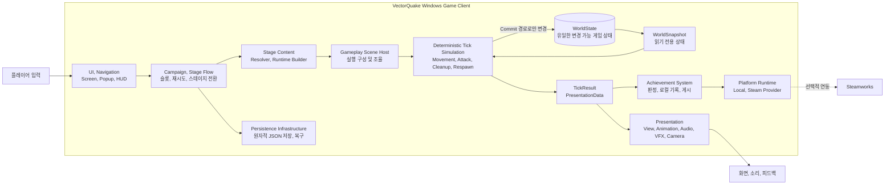
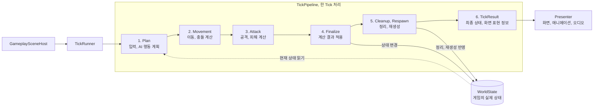

# 2026TeamProject_J2M
2026 팀프로젝트 김종우(D) 권민혁(P) 진현우(G)


## Structure

1. 시스템 전체 구조
 ```mermaid
flowchart LR
    Player["플레이어"]
    Developer["개발자, 스테이지 제작자"]
    Steam["Steam Platform<br/>선택적 외부 시스템"]

    subgraph System["VectorQuake 시스템"]
        Client["Windows Game Client<br/>Unity 6, C#"]
        Save[("Local Save Store<br/>JSON")]
        Editor["Unity Editor<br/>Stage Authoring Tools"]
        Build["Build, Test<br/>Release Toolchain"]
    end

    Player -->|"게임 플레이"| Client
    Client -->|"캠페인 진행도, 설정 저장"| Save

    Developer -->|"스테이지 제작"| Editor
    Editor -->|"StageContentEntry 생성"| Build
    Build -->|"검증, 빌드"| Client

    Client -.->|"Steam 빌드에서만<br/>업적, 플랫폼 기능"| Steam
```
2. 게임 클라이언트 내부 구조

3. TickPipeline 구조


   
## Docs
- Start with [Docs/Architecture/README.md](Docs/Architecture/README.md) for the current gameplay architecture truth-source.
- Use [Docs/Testing/Gameplay-Test-Automation-Guide.md](Docs/Testing/Gameplay-Test-Automation-Guide.md) for runner usage, governance, and developer workflow.
- Use [Docs/Testing/Full-EditMode-Baseline-2026-04-13.md](Docs/Testing/Full-EditMode-Baseline-2026-04-13.md) for the pinned validation baseline and touched-cluster readout.
